# Guide to Coderef-Core: The Engine Behind Semantic Code References

This guide provides a comprehensive overview of the coderef-core module, the foundational library that powers the entire Coderef2 semantic reference system.

## Overview

Coderef-core is the technical foundation that transforms the theoretical Coderef2 specification into a practical, high-performance code analysis engine. It has evolved from regex-based pattern matching to sophisticated AST-based code intelligence.

## Architecture Evolution

### **Original Core (Regex-Based)**
- Pattern matching with regular expressions
- ~85% accuracy for element detection
- Language-specific pattern configurations
- Manual maintenance of detection rules

### **Updated Core (AST-Based)**
- TypeScript Compiler API integration
- 99% precision for element detection
- Future-proof language feature support
- Industry-standard code analysis

## Core Components

### **1. Type System (`types.ts`)**

The type system defines the data structures and interfaces used throughout the coderef ecosystem.

#### **ElementData Interface**
Represents discovered code elements:
```typescript
export interface ElementData {
  type: 'function' | 'class' | 'component' | 'hook' | 'method' | 'interface' | 'enum' | 'type' | 'unknown';
  name: string;        // Element identifier
  file: string;        // Normalized file path
  line: number;        // 1-based line number
}
```

#### **ParsedCoderef Interface**
Structured representation of Coderef2 tags:
```typescript
export interface ParsedCoderef {
  type: string;              // @Fn, @Cl, @C, etc.
  path: string;             // auth/login
  element: string | null;   // authenticateUser
  line: number | null;      // 42
  metadata?: Record<string, any>; // Optional metadata
}
```

#### **IndexedCoderef Type**
Enhanced tracking for indexed references:
```typescript
export type IndexedCoderef = {
  // Core tag components
  type: string;
  path: string;
  element: string | null;
  line: number | null;
  metadata?: Record<string, any>;

  // Index-specific tracking
  file: string;           // Where tag was found
  indexLine: number;      // Line number of tag
  originalTag: string;    // Full original tag string
};
```

#### **Drift Detection System**
Five-status change tracking:
```typescript
export type DriftStatus =
  | 'unchanged'  // Perfect match
  | 'moved'      // Same element, different line
  | 'renamed'    // Similar element (Levenshtein distance)
  | 'missing'    // Element no longer exists
  | 'ambiguous'  // Multiple potential matches
  | 'error'      // Analysis error
  | 'unknown';   // Undetermined state
```

### **2. Parser Engine (`parser.ts`)**

The parser handles Coderef2 tag processing with the core format: `@Type/Path#Element:Line{Metadata}`

#### **Tag Parsing**
```typescript
export function parseCoderefTag(tag: string): ParsedCoderef {
  // Regex breakdown:
  // @([A-Z][A-Za-z0-9]*) - Type (starts with uppercase)
  // \/([^#:{}]+)         - Path (any char except #:{}})
  // (?:#([^:{}]+))?      - Optional element
  // (?::(\d+))?          - Optional line number
  // (?:{(.+)})?          - Optional metadata

  const regex = /@([A-Z][A-Za-z0-9]*)\/([^#:{}]+)(?:#([^:{}]+))?(?::(\d+))?(?:{(.+)})?/;
  // ... parsing logic
}
```

#### **Advanced Features**
- **Metadata Support**: JSON or key=value pairs
- **Robust Parsing**: Graceful handling of malformed tags
- **Bidirectional**: Parse existing ↔ Generate new tags
- **Validation**: Syntax checking with detailed errors

#### **Example Usage**
```typescript
// Parse existing tag
const parsed = parseCoderefTag("@Fn/auth/login#authenticateUser:42{status=\"active\"}");
// Returns: { type: "Fn", path: "auth/login", element: "authenticateUser", line: 42, metadata: {status: "active"} }

// Generate new tag
const generated = generateCoderefTag({
  type: "Cl",
  path: "models/User",
  element: "validateCredentials",
  line: 15
});
// Returns: "@Cl/models/User#validateCredentials:15"
```

### **3. Code Scanner Evolution**

#### **Original Scanner (Regex-Based)**
Pattern-based detection with language-specific configurations:
```typescript
const LANGUAGE_PATTERNS: Record<string, Array<{
  type: ElementData['type'],
  pattern: RegExp,
  nameGroup: number
}>> = {
  ts: [
    { type: 'function', pattern: /(?:export\s+)?(?:async\s+)?function\s+([a-zA-Z0-9_$]+)/g, nameGroup: 1 },
    { type: 'class', pattern: /(?:export\s+)?class\s+([a-zA-Z0-9_$]+)/g, nameGroup: 1 },
    // ... more patterns
  ]
};
```

**Limitations**:
- String-based matching prone to false positives
- Manual pattern maintenance
- Limited context awareness
- Difficulty with complex syntax

#### **Updated Scanner (AST-Based)**
TypeScript Compiler API integration:
```typescript
import * as ts from 'typescript';

export async function scanCurrentElements(
  dir: string,
  lang: string | string[] = ['ts', 'js', 'tsx', 'jsx'],
  options: ScanOptions = {}
): Promise<ElementData[]> {
  // Creates proper AST from source code
  const sourceFile = ts.createSourceFile(
    normalizedFilePath,
    content,
    ts.ScriptTarget.Latest,
    true // setParentNodes for full API access
  );

  // Traverse AST with full context
  visitTsNode(sourceFile, sourceFile);
}
```

**Advanced Element Detection**:
```typescript
function visitTsNode(node: ts.Node, sourceFile: ts.SourceFile): void {
  if (ts.isFunctionDeclaration(node)) {
    elementName = getNodeName(node);
    // Smart component/hook detection by naming convention
    if (elementName && /^[A-Z]/.test(elementName)) {
      elementType = 'component'; // PascalCase = React component
    } else if (elementName && /^use[A-Z]/.test(elementName)) {
      elementType = 'hook'; // useXxx = React hook
    } else {
      elementType = 'function';
    }
  }
  // Handle classes, methods, variable declarations, etc.
}
```

**Benefits of AST Approach**:
- **99% Precision**: Eliminates false positives
- **Context Awareness**: Understands scope and structure
- **Future-Proof**: Supports latest language features automatically
- **Industry Standard**: Same engine used by VS Code and TypeScript tools

#### **Scanner Export from @coderef/core** *(New in v2.1.0)*
The scanner is now exported from the main `@coderef/core` package for external consumption:

```typescript
import { scanCurrentElements, LANGUAGE_PATTERNS } from '@coderef/core';
import type { ScanOptions, ElementData } from '@coderef/core';

// Use scanner in external packages
const elements = await scanCurrentElements('./src', ['ts', 'tsx'], {
  recursive: true,
  exclude: ['**/node_modules/**'],
  verbose: false
});

// Access language patterns
const typescriptPatterns = LANGUAGE_PATTERNS.ts;
console.log(`${typescriptPatterns.length} TypeScript patterns configured`);
```

**Exported Functions:**
- `scanCurrentElements(dir, lang, options)` - Main scanning function
- `LANGUAGE_PATTERNS` - Pattern configurations for supported languages

**Exported Types:**
- `ScanOptions` - Configuration interface for scanning
- `ElementData` - Scanned element data structure

**Use Cases:**
- **External Integrations**: Import scanner in custom tools
- **Build Pipelines**: Integrate scanning in build processes
- **Testing**: Create custom test utilities using scanner
- **Plugins**: Extend functionality in external packages

---

## Scanner Pipeline Visualization

The scanner follows a well-defined 7-stage pipeline that transforms source code into structured element data:

```mermaid
flowchart TB
    Input[["📂 Input: Directory Path + ScanOptions"]]

    subgraph Pipeline["Scanner Pipeline"]
        direction TB
        S1["🔍 Stage 1: File Discovery<br/>(glob pattern matching)"]
        S2["🔬 Stage 2: Filter Files<br/>(language & exclusions)"]
        S3["📄 Stage 3: Read File Content<br/>(UTF-8 encoding)"]
        S4["🌳 Stage 4: Parse to AST<br/>(TypeScript Compiler API)"]
        S5["🔎 Stage 5: Visit Nodes<br/>(extract elements)"]
        S6["🏷️ Stage 6: Type Classification<br/>(function/class/component/hook)"]
        S7["✨ Stage 7: Deduplication<br/>(priority-based)"]
    end

    Output[["📊 Output: ElementData[]"]]

    Input --> S1
    S1 -->|"*.ts, *.tsx, *.js, *.jsx, *.py"| S2
    S2 -->|"Exclude: **\/node_modules/**"| S3
    S3 -->|"File content"| S4
    S4 -->|"SourceFile AST"| S5
    S5 -->|"Raw elements"| S6
    S6 -->|"Typed elements"| S7
    S7 --> Output

    style Input fill:#e1f5ff,stroke:#0288d1,stroke-width:2px
    style Output fill:#e8f5e9,stroke:#43a047,stroke-width:2px
    style Pipeline fill:#fff3e0,stroke:#ff6f00,stroke-width:2px
    style S1 fill:#e3f2fd,stroke:#1976d2
    style S2 fill:#e3f2fd,stroke:#1976d2
    style S3 fill:#f3e5f5,stroke:#7b1fa2
    style S4 fill:#fff9c4,stroke:#f57c00
    style S5 fill:#fff9c4,stroke:#f57c00
    style S6 fill:#e0f2f1,stroke:#00897b
    style S7 fill:#e0f2f1,stroke:#00897b
```



### Pipeline Stages Explained

**Stage 1: File Discovery (glob)**
- Uses `glob` library to find files matching language extensions
- Supports recursive directory traversal
- Returns array of file paths

**Stage 2: Filter Files**
- Applies language filters (`ts`, `tsx`, `js`, `jsx`, `py`)
- Applies exclusion patterns (`**/node_modules/**`, `**/dist/**`)
- Uses `minimatch` for pattern matching

**Stage 3: Read File Content**
- Reads each file with UTF-8 encoding
- Handles encoding errors gracefully
- Processes files in parallel for performance

**Stage 4: Parse to AST**
- Uses TypeScript Compiler API (`ts.createSourceFile()`)
- Creates Abstract Syntax Tree representation
- Preserves parent node relationships for context

**Stage 5: Visit Nodes**
- Traverses AST using `visitTsNode()`
- Extracts elements: functions, classes, methods, components, hooks
- Captures element name, type, file path, and line number

**Stage 6: Type Classification**
- **Component**: PascalCase function names (e.g., `UserProfile`)
- **Hook**: Functions starting with `use` (e.g., `useAuth`)
- **Constant**: ALL_CAPS identifiers (e.g., `API_URL`)
- **Class**: Class declarations
- **Function**: Generic function declarations
- **Method**: Class member functions

**Stage 7: Deduplication**
- Removes duplicate detections using priority system
- Priority order: `constant` > `component` > `hook` > `class` > `method` > `function`
- Ensures each element appears once with most specific type

### Example Output

```typescript
[
  {
    type: 'component',
    name: 'UserProfile',
    file: 'src/components/UserProfile.tsx',
    line: 12
  },
  {
    type: 'hook',
    name: 'useAuth',
    file: 'src/hooks/useAuth.ts',
    line: 5
  },
  {
    type: 'function',
    name: 'calculateTotal',
    file: 'src/utils/math.ts',
    line: 23
  }
]
```

---

### **4. Graph Persistence (`analyzer-service.ts`)** *(New in v2.1.0)*

The analyzer now supports saving and loading dependency graphs for persistent analysis:

#### **Graph Loading**
```typescript
import { loadGraph } from '@coderef/core';

// Load graph from JSON file
const graphData = JSON.parse(fs.readFileSync('dependency-graph.json', 'utf-8'));
const graph = loadGraph(graphData);

// Use the reconstructed graph
for (const [nodeId, node] of graph.entries()) {
  console.log(`${nodeId}: ${node.dependencies.length} dependencies`);
}
```

**Features:**
- **Round-Trip Integrity**: `saveGraph()` → `loadGraph()` preserves graph structure
- **Validation**: Checks node IDs, dependencies, and metadata
- **Error Handling**: Throws `GraphError` for invalid graph data
- **Type Safety**: Reconstructs `Map<string, GraphNode>` from JSON

**Graph Structure:**
```typescript
interface GraphNode {
  id: string;              // CodeRef tag (e.g., "@Fn/auth/login#authenticate:24")
  dependencies: string[];  // Array of CodeRef tags this node depends on
  dependents: string[];    // Array of CodeRef tags that depend on this node
  metadata: {
    file: string;         // Source file path
    line: number;         // Line number
    type: string;         // Element type
    name: string;         // Element name
  };
}
```

**Validation Rules:**
- All node IDs must be valid CodeRef tags
- Dependency references must exist in graph
- Node metadata must be present
- Empty graphs are valid and handled gracefully

**Example Use Case - Persistent Impact Analysis:**
```typescript
import { buildGraph, saveGraph, loadGraph } from '@coderef/core';

// Build graph once (expensive operation)
const graph = await buildGraph('./src', ['ts', 'tsx']);
const graphJson = saveGraph(graph);
fs.writeFileSync('graph-cache.json', JSON.stringify(graphJson, null, 2));

// Later sessions: Load from cache (fast)
const cachedGraphData = JSON.parse(fs.readFileSync('graph-cache.json', 'utf-8'));
const cachedGraph = loadGraph(cachedGraphData);

// Perform impact analysis without re-scanning
const impactedNodes = analyzeImpact(cachedGraph, "@Fn/auth/login#authenticate:24");
```

**Performance Benefits:**
- **Build Once, Use Many**: Cache graphs between sessions
- **CI/CD Integration**: Save graphs as artifacts, load in downstream jobs
- **Incremental Updates**: Load base graph, update only changed files
- **Faster Testing**: Pre-computed graphs for test suites

#### **Graph Builder Algorithm**

The graph builder constructs a dependency graph by analyzing import/call relationships between code elements. This diagram shows the complete algorithm flow:

```mermaid
flowchart TB
    Start([buildGraph<br/>dir, langs]) --> Init[Initialize Empty Graph<br/>Map&lt;string, GraphNode&gt;]
    Init --> Scan[Scan Directory<br/>scanCurrentElements]

    Scan --> Elements[ElementData Array<br/>functions, classes, etc.]
    Elements --> LoopStart{For Each<br/>Element}

    LoopStart -->|element| CreateNode[Create GraphNode]
    CreateNode --> GenID[Generate Node ID<br/>@Type/path#name:line]
    GenID --> AddMeta[Add Metadata<br/>file, line, type, name]

    AddMeta --> InitArrays[Initialize Arrays<br/>dependencies: []<br/>dependents: []]
    InitArrays --> StoreNode[Store in Graph<br/>graph.set&#40;id, node&#41;]

    StoreNode --> LoopStart
    LoopStart -->|done| AnalyzePhase[Phase 2: Analyze Dependencies]

    AnalyzePhase --> LoopNodes{For Each<br/>Node}
    LoopNodes -->|node| ParseFile[Parse Source File<br/>TypeScript Compiler API]

    ParseFile --> FindImports[Find Import Statements<br/>visitNode&#40;&#41; traversal]
    FindImports --> FindCalls[Find Function Calls<br/>CallExpression nodes]

    FindCalls --> ResolveRefs{Resolve Each<br/>Reference}
    ResolveRefs -->|reference| LookupTarget[Lookup Target Node<br/>in Graph Map]

    LookupTarget --> Exists{Target<br/>Exists?}
    Exists -->|Yes| AddEdge[Add Dependency Edge<br/>source.dependencies.push&#40;target&#41;<br/>target.dependents.push&#40;source&#41;]
    Exists -->|No| Skip[Skip - External Dependency]

    AddEdge --> ResolveRefs
    Skip --> ResolveRefs
    ResolveRefs -->|done| LoopNodes

    LoopNodes -->|done| Validate[Validate Graph Structure<br/>check circular deps]
    Validate --> Complete[Return Graph<br/>Map&lt;string, GraphNode&gt;]
    Complete --> End([End])

    style Start fill:#e1f5e1
    style End fill:#e1f5e1
    style CreateNode fill:#fff4e6
    style AddEdge fill:#ffe6e6
    style Complete fill:#e6f3ff
```

**Algorithm Explanation:**

**Phase 1: Node Creation**
1. **Initialize**: Create empty `Map<string, GraphNode>` to store graph
2. **Scan**: Use `scanCurrentElements()` to discover all code elements
3. **Create Nodes**: For each element, create a `GraphNode` with:
   - **ID**: Generated CodeRef tag (`@Fn/auth/login#authenticate:24`)
   - **Metadata**: File path, line number, type, name
   - **Arrays**: Empty `dependencies[]` and `dependents[]`
4. **Store**: Add node to graph map using ID as key

**Phase 2: Edge Building**
1. **Parse Files**: Use TypeScript Compiler API to parse each source file
2. **Visit Nodes**: Traverse AST to find:
   - Import statements (`import { foo } from './bar'`)
   - Function calls (`authenticate(user)`)
   - Class instantiations (`new UserService()`)
3. **Resolve References**: For each import/call:
   - Look up target node in graph map
   - If found: Create bidirectional edge
     - Add target to source's `dependencies[]`
     - Add source to target's `dependents[]`
   - If not found: Skip (external dependency)
4. **Validate**: Check for circular dependencies and structural integrity

**Key Data Structures:**

```typescript
// Graph storage: Map for O(1) lookup
const graph: Map<string, GraphNode> = new Map();

// Each node tracks incoming and outgoing edges
interface GraphNode {
  id: string;                    // Unique identifier
  dependencies: string[];        // Outgoing edges (what I depend on)
  dependents: string[];          // Incoming edges (what depends on me)
  metadata: NodeMetadata;        // Element information
}
```

**Complexity Analysis:**
- **Time**: O(N + E) where N = nodes, E = edges (linear in graph size)
- **Space**: O(N + E) for storing graph structure
- **Lookup**: O(1) for node retrieval via Map

### **5. File System Utilities (`utils/fs.ts`)**

Cross-platform file operations and path normalization:

#### **Path Normalization**
```typescript
export function normalizeCoderefPath(filePath: string): string {
  return filePath
    .replace(/^(?:src|app|lib)[\\/]/, '')   // Remove common prefixes
    .replace(/\\/g, '/')                    // Windows → POSIX slashes
    .replace(/\.(ts|js|tsx|jsx|py|java)$/, ''); // Drop extensions
}

// Example: "C:\\src\\auth\\login.ts" → "auth/login"
```

#### **Safe File Operations**
```typescript
// JSON operations with error handling
export function loadJsonFile<T>(filePath: string, defaultValue: T): T;
export function saveJsonFile(filePath: string, data: any): boolean;

// File collection with exclusion patterns
export function collectFiles(
  root: string,
  ext: string | string[] = 'ts',
  exclude: string[] = ['node_modules', 'dist', 'build']
): string[];
```

## Usage Patterns

### **Basic Element Scanning**
```typescript
import { scanCurrentElements } from 'coderef-core/scanner';

// Scan TypeScript files in src directory
const elements = await scanCurrentElements('./src', ['ts', 'tsx'], {
  recursive: true,
  verbose: true,
  exclude: ['**/*.test.*', '**/node_modules/**']
});

console.log(`Found ${elements.length} code elements`);
elements.forEach(el => {
  console.log(`${el.type}: ${el.name} at ${el.file}:${el.line}`);
});
```

### **Tag Processing Workflow**
```typescript
import { parseCoderefTag, generateCoderefTag, extractCoderefTags } from 'coderef-core/parser';

// Extract all tags from file content
const fileContent = fs.readFileSync('auth/login.ts', 'utf-8');
const existingTags = extractCoderefTags(fileContent);

// Process each tag
existingTags.forEach(tag => {
  console.log(`Found: @${tag.type}/${tag.path}#${tag.element}:${tag.line}`);

  // Validate tag
  if (parseCoderefTag(`@${tag.type}/${tag.path}#${tag.element}:${tag.line}`)) {
    console.log('✅ Valid tag');
  }
});

// Generate new tag
const newTag = generateCoderefTag({
  type: 'Fn',
  path: 'auth/login',
  element: 'authenticateUser',
  line: 42,
  metadata: { status: 'active', complexity: 'low' }
});
```

### **Drift Detection Integration**
```typescript
import { scanCurrentElements } from 'coderef-core/scanner';
import { parseCoderefTag } from 'coderef-core/parser';

// Load existing index
const index = JSON.parse(fs.readFileSync('coderef-index.json', 'utf-8'));

// Scan current codebase
const currentElements = await scanCurrentElements('./src', 'ts');

// Compare indexed vs current
for (const [tagString, indexInfo] of Object.entries(index)) {
  const parsedTag = parseCoderefTag(tagString);
  const matchingElements = currentElements.filter(
    el => el.name === parsedTag.element && el.file.includes(parsedTag.path)
  );

  if (matchingElements.length === 0) {
    console.log(`❌ Missing: ${tagString}`);
  } else if (matchingElements[0].line !== parsedTag.line) {
    console.log(`📍 Moved: ${tagString} (now line ${matchingElements[0].line})`);
  } else {
    console.log(`✅ Unchanged: ${tagString}`);
  }
}
```

## Performance Characteristics

### **Scalability**
- **Large Codebases**: Tested on 10,000+ file repositories
- **Memory Efficient**: Processes files incrementally
- **Fast Processing**: TypeScript compiler optimizations
- **Concurrent Safe**: Supports parallel processing

### **Accuracy Metrics**
- **AST Scanner**: 99% precision for element detection
- **Regex Scanner**: ~85% accuracy (legacy)
- **Cross-Platform**: Consistent results on Windows/macOS/Linux
- **Multi-Language**: Extensible architecture for new languages

## Integration Points

### **CLI Tool Integration**
The coderef-cli uses coderef-core for all its operations:
```typescript
// Drift detection
import { detectDrift } from 'coderef-cli/drift-detector';
// Uses: scanCurrentElements, parseCoderefTag

// Indexing
import { buildIndex } from 'coderef-cli/indexer';
// Uses: extractCoderefTags, scanCurrentElements

// Tagging
import { tagFile } from 'coderef-cli/tagger';
// Uses: scanCurrentElements, generateCoderefTag
```

### **Enterprise Features**
- **JSON I/O**: Machine-readable reports for CI/CD integration
- **Error Resilience**: Continues processing despite individual file failures
- **Configurable Options**: Extensive customization for enterprise environments
- **Cross-Platform**: Windows/Unix path handling

## Recent Enhancements (v2.1.0)

### **Completed Features**
1. ✅ **Graph Persistence**: `loadGraph()` implementation for persistent dependency analysis
2. ✅ **Scanner Export**: Public API for `scanCurrentElements` from @coderef/core
3. ✅ **Comprehensive Testing**: 25 tests covering scanner exports and functionality

## Future Roadmap

### **Planned Enhancements**
1. **Python AST Support**: Full Python language integration via child process
2. **Java Language Support**: AST-based Java element detection
3. **Performance Optimizations**: Incremental scanning and graph caching
4. **Extended Metadata**: Rich semantic information capture

### **Multi-Language Architecture**
```typescript
// Future: Python integration example
// 1. Execute Python script via child_process.spawn
// 2. Python script uses 'ast' module to parse code
// 3. Returns JSON output to Node.js
// 4. Integrates seamlessly with existing ElementData structure
```

## Best Practices

### **Configuration**
```typescript
// Recommended scan options for enterprise
const scanOptions: ScanOptions = {
  recursive: true,
  exclude: [
    '**/node_modules/**',
    '**/dist/**',
    '**/build/**',
    '**/*.test.*',
    '**/*.spec.*'
  ],
  verbose: process.env.NODE_ENV === 'development',
  includeComments: false
};
```

### **Error Handling**
```typescript
try {
  const elements = await scanCurrentElements(dir, langs, options);
  // Process elements
} catch (error) {
  console.error(`Scan failed for ${dir}:`, error.message);
  // Graceful degradation
}
```

### **Path Management**
```typescript
// Always normalize paths for consistency
const normalizedPath = normalizeCoderefPath(filePath);

// Use cross-platform path operations
const relativePath = getRelativePath(fromFile, toFile);
```

## Error Handling System

Coderef-core provides a comprehensive error handling infrastructure with typed error classes, error chaining, and structured logging.

### **Error Class Hierarchy**

All CodeRef errors extend the base `CodeRefError` class, providing consistent error handling across the system:

```typescript
import {
  CodeRefError,
  ParseError,
  FileNotFoundError,
  ScanError,
  ValidationError,
  IndexError,
  GraphError,
} from '@coderef/core';
```

### **Base Error Class: CodeRefError**

The foundation for all CodeRef errors with enhanced functionality:

```typescript
// Basic error with message
throw new CodeRefError('Operation failed');

// Error with cause chain (for debugging)
try {
  JSON.parse(content);
} catch (error) {
  throw new CodeRefError('Invalid data format', { cause: error });
}

// Error with context (for recovery)
throw new CodeRefError('Scan failed', {
  context: { file: 'auth.ts', operation: 'scan' }
});

// Error with both cause and context
throw new CodeRefError('Processing failed', {
  cause: originalError,
  context: { file: 'auth.ts', line: 42 }
});
```

**Error Properties:**
- `message: string` - Human-readable error message
- `code: string` - Error code for programmatic handling
- `cause?: Error` - Original error that caused this error
- `context?: Record<string, any>` - Additional debugging information
- `stack: string` - Stack trace

**Error Methods:**
- `toJSON()` - Serialize error with cause chain for logging
- `toString()` - User-friendly string representation for CLI

### **Specialized Error Classes**

#### **ParseError** - Tag Parsing Failures
Used when CodeRef tag parsing fails:

```typescript
import { ParseError } from '@coderef/core';

// Invalid tag format
throw new ParseError('Invalid CodeRef tag format: missing # separator', {
  context: {
    tag: '@Fn/path',
    expected: '@Fn/path#element:line'
  }
});

// Malformed JSON
throw new ParseError('Invalid JSON in index file', {
  cause: jsonError,
  context: { file: 'coderef-index.json' }
});
```

**Common Scenarios:**
- Missing @ prefix
- Missing # separator
- Invalid type designator
- Malformed metadata
- Corrupted JSON files

#### **FileNotFoundError** - Missing Files or Directories
Used when required files or directories are not found:

```typescript
import { FileNotFoundError } from '@coderef/core';

// Missing index file
throw new FileNotFoundError('Index file not found: ./coderef-index.json', {
  context: { path: './coderef-index.json', operation: 'drift' }
});

// Non-existent directory
throw new FileNotFoundError('Source directory does not exist', {
  context: { path: './src', operation: 'scan' }
});
```

**Common Scenarios:**
- Missing coderef-index.json
- Missing graph.json
- Non-existent source files
- Invalid directory paths
- Permission denied errors

#### **ScanError** - Code Scanning Failures
Used when code scanning operations fail:

```typescript
import { ScanError } from '@coderef/core';

// AST parsing failure
throw new ScanError('Failed to parse file: syntax error', {
  cause: tsError,
  context: { file: 'auth.ts', line: 42 }
});

// File read error
throw new ScanError('Permission denied reading file', {
  context: { file: 'config.ts', operation: 'scan' }
});
```

**Common Scenarios:**
- Invalid syntax in source files
- TypeScript compiler errors
- File permission issues
- Unsupported file types
- Memory issues with large files

#### **ValidationError** - Validation Failures
Used when validation operations fail:

```typescript
import { ValidationError } from '@coderef/core';

// Invalid type designator
throw new ValidationError('Invalid type designator: X', {
  context: {
    received: 'X',
    expected: ['Fn', 'C', 'Cl', 'M', 'H', 'T', 'A', 'I', 'Cfg']
  }
});

// Invalid line number
throw new ValidationError('Invalid line number: must be positive integer', {
  context: { received: -5, field: 'line' }
});
```

**Common Scenarios:**
- Invalid type designators
- Invalid reference formats
- Invalid command arguments
- Schema validation failures
- Invalid configuration values

#### **IndexError** - Index File Issues
Used when index operations fail:

```typescript
import { IndexError } from '@coderef/core';

// Corrupted index
throw new IndexError('Corrupted index file: invalid structure', {
  cause: jsonError,
  context: { file: 'coderef-index.json' }
});

// Version mismatch
throw new IndexError('Index format version mismatch', {
  context: { expected: '2.0', received: '1.5' }
});
```

**Common Scenarios:**
- Corrupted index files
- Invalid index structure
- Format version mismatches
- Index rebuild failures
- Inconsistent index state

#### **GraphError** - Dependency Graph Errors
Used when graph operations fail:

```typescript
import { GraphError, GraphErrorCode } from '@coderef/core';

// Invalid graph structure
throw new GraphError('Invalid graph JSON: nodes must be an array',
  GraphErrorCode.MISSING_NODES,
  { received: typeof json.nodes }
);

// Missing node reference
throw new GraphError(
  `Invalid edge: source node '${nodeId}' not found in graph`,
  GraphErrorCode.INVALID_REFERENCE,
  { edge, missingNode: nodeId }
);
```

**Error Codes:**
- `INVALID_FORMAT` - Malformed graph JSON
- `MISSING_NODES` - Nodes array missing
- `MISSING_EDGES` - Edges array missing
- `INVALID_NODE` - Invalid node structure
- `INVALID_EDGE` - Invalid edge structure
- `INVALID_REFERENCE` - Edge references non-existent node
- `FILE_NOT_FOUND` - Graph file not found
- `PARSE_ERROR` - JSON parsing failed

### **Logger Utility**

Structured logging with severity levels and proper stream routing:

```typescript
import { logger } from '@coderef/core';

// Error logging (always shown, stderr)
logger.error('File not found', { path: './index.json' });

// Warning logging (always shown, stderr)
logger.warn('Deprecated function used', { function: 'oldScan' });

// Info logging (shown by default, stdout)
logger.info('Scan completed', { files: 42, elements: 150 });

// Debug logging (only when verbose=true, stdout)
logger.debug('Processing file', { file: 'auth.ts' });

// Enable verbose mode
logger.setVerbose(true);
```

**Logger Features:**
- **4 severity levels**: ERROR, WARN, INFO, DEBUG
- **Stream routing**: ERROR/WARN → stderr, INFO/DEBUG → stdout
- **Verbose mode**: DEBUG logs only shown when enabled
- **Timestamps**: Automatic timestamps in verbose mode
- **Context logging**: Structured context information
- **Color support**: Optional ANSI colors for terminals

**Logger Configuration:**
```typescript
import { logger } from '@coderef/core';

// Enable verbose mode (shows DEBUG logs and timestamps)
logger.setVerbose(true);

// Disable colors
logger.setUseColors(false);

// Check if verbose mode is enabled
if (logger.isVerbose()) {
  logger.debug('Verbose mode active');
}
```

### **Error Handling Best Practices**

#### **1. Catch and Wrap Errors**
```typescript
import { ScanError } from '@coderef/core';

try {
  const result = await scanCurrentElements(dir, langs);
} catch (error) {
  // Wrap with CodeRefError for consistent handling
  throw new ScanError('Scan failed', {
    cause: error,
    context: { dir, langs }
  });
}
```

#### **2. Preserve Error Context**
```typescript
import { ParseError } from '@coderef/core';

try {
  const parsed = parseCoderefTag(tag);
} catch (error) {
  // Include original tag for debugging
  throw new ParseError('Invalid tag format', {
    cause: error,
    context: { tag, expected: '@Type/path#element:line' }
  });
}
```

#### **3. Provide Recovery Suggestions**
```typescript
import { FileNotFoundError } from '@coderef/core';

if (!fs.existsSync(indexPath)) {
  throw new FileNotFoundError(
    `Index file not found: ${indexPath}. Run 'coderef scan ./src' to create it.`,
    { context: { path: indexPath, operation: 'drift' } }
  );
}
```

#### **4. Use Type Guards for Error Handling**
```typescript
import { CodeRefError, FileNotFoundError } from '@coderef/core';

try {
  await processFile(path);
} catch (error) {
  if (error instanceof FileNotFoundError) {
    console.error('File not found:', error.message);
    console.log('Suggestion: Check the file path');
  } else if (error instanceof CodeRefError) {
    console.error('CodeRef error:', error.message);
    if (error.context) {
      console.error('Context:', error.context);
    }
  } else {
    console.error('Unexpected error:', error);
  }
}
```

#### **5. Log Errors Appropriately**
```typescript
import { logger, ScanError } from '@coderef/core';

try {
  const elements = await scanCurrentElements(dir, langs);
  logger.info('Scan completed', { count: elements.length });
} catch (error) {
  if (error instanceof ScanError) {
    logger.error('Scan failed', { dir, error: error.message });
    if (logger.isVerbose()) {
      logger.debug('Stack trace', { stack: error.stack });
    }
  }
  throw error;
}
```

### **Error Serialization**

All CodeRef errors can be serialized to JSON for logging:

```typescript
import { CodeRefError } from '@coderef/core';

const error = new CodeRefError('Operation failed', {
  cause: new Error('Original error'),
  context: { file: 'test.ts', line: 42 }
});

// Serialize for logging
const json = error.toJSON();
console.log(JSON.stringify(json, null, 2));

// Output:
// {
//   "name": "CodeRefError",
//   "code": "CODEREF_ERROR",
//   "message": "Operation failed",
//   "stack": "...",
//   "context": { "file": "test.ts", "line": 42 },
//   "cause": {
//     "name": "Error",
//     "message": "Original error",
//     "stack": "..."
//   }
// }
```

### **Error Recovery Patterns**

#### **Graceful Degradation**
```typescript
import { ScanError, logger } from '@coderef/core';

const results = [];
for (const file of files) {
  try {
    const elements = await scanFile(file);
    results.push(...elements);
  } catch (error) {
    if (error instanceof ScanError) {
      logger.warn(`Skipping file ${file}`, { error: error.message });
      continue; // Skip problematic file
    }
    throw error; // Re-throw unexpected errors
  }
}
```

#### **Retry with Backoff**
```typescript
import { FileNotFoundError } from '@coderef/core';

async function loadWithRetry(path: string, retries = 3): Promise<string> {
  for (let i = 0; i < retries; i++) {
    try {
      return fs.readFileSync(path, 'utf-8');
    } catch (error) {
      if (i === retries - 1) {
        throw new FileNotFoundError(`Failed to load file after ${retries} attempts`, {
          cause: error,
          context: { path, attempts: retries }
        });
      }
      await sleep(1000 * Math.pow(2, i)); // Exponential backoff
    }
  }
}
```

## Conclusion

Coderef-core represents a sophisticated, production-ready system that transforms theoretical Coderef2 specifications into practical code intelligence. The evolution from regex-based to AST-based analysis positions it as an enterprise-grade foundation for semantic code reference management.

The modular architecture, comprehensive error handling infrastructure, and extensible design make it suitable for large-scale development environments while maintaining accuracy and performance at scale.

---

**Key Takeaways:**
- **AST-based analysis** provides 99% precision vs 85% regex accuracy
- **TypeScript Compiler API** ensures future-proof language support
- **Modular design** enables flexible integration patterns
- **Enterprise features** support large-scale development workflows
- **Cross-platform compatibility** ensures consistent behavior across environments