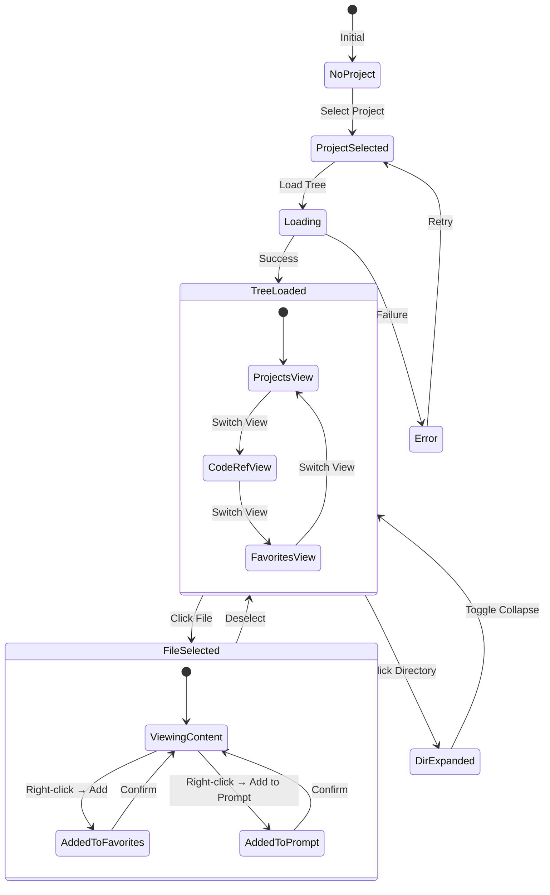
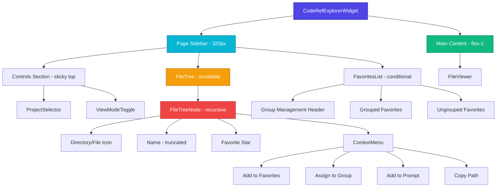
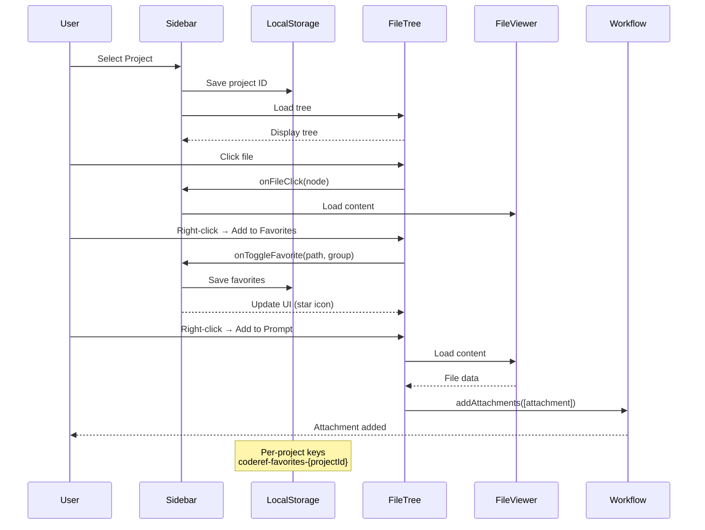

# Explorer Sidebar - Comprehensive Reference Documentation

**Component:** CodeRef Explorer Page-Specific Sidebar
**Version:** 0.6.0
**Last Updated:** 2026-01-02
**Status:** Production

---

## Table of Contents

1. [Architecture Overview](#architecture-overview)
2. [Attributes & Characteristics](#attributes--characteristics)
3. [Behaviors](#behaviors)
4. [States](#states)
5. [Integration Points](#integration-points)
6. [Performance Considerations](#performance-considerations)
7. [Accessibility](#accessibility)
8. [Testing Strategy](#testing-strategy)
9. [Visual Diagrams](#visual-diagrams)

---

## Architecture Overview

### Component Hierarchy

```
CodeRefExplorerWidget (root)
├── Page Sidebar (320px fixed width)
│   ├── Controls Section (sticky top)
│   │   ├── ProjectSelector
│   │   └── ViewModeToggle
│   ├── FileTree (scrollable)
│   │   └── FileTreeNode (recursive)
│   │       ├── Directory/File Icon
│   │       ├── Name (truncated)
│   │       ├── Favorite Star
│   │       └── ContextMenu (on right-click)
│   │           ├── Add/Remove Favorite
│   │           ├── Assign to Group (submenu)
│   │           ├── Add to Prompt
│   │           └── Copy Path
│   └── FavoritesList (favorites view mode)
│       ├── Group Management Header
│       ├── Grouped Favorites
│       └── Ungrouped Favorites
└── Main Content Area (flex-1)
    └── FileViewer

```

### Physical Structure

```tsx
<div className="h-full flex overflow-hidden bg-ind-bg">
  {/* SIDEBAR: Fixed 320px */}
  <div className="w-80 min-w-80 max-w-80 basis-80 flex-shrink-0 flex-grow-0 overflow-hidden ...">
    {/* Controls (sticky top-0) */}
    <div className="flex-shrink-0 sticky top-0 z-10 bg-ind-panel">
      <ProjectSelector />
      <ViewModeToggle />
    </div>

    {/* File Tree (scrollable) */}
    <FileTree />
  </div>

  {/* MAIN CONTENT: Flexible width */}
  <div className="flex-1">
    <FileViewer />
  </div>
</div>
```

---

## Attributes & Characteristics

### Dimensional Attributes

| Attribute | Value | Purpose |
|-----------|-------|---------|
| **Width** | `320px` | Fixed sidebar width (w-80) |
| **Min Width** | `320px` | Prevents shrinking (min-w-80) |
| **Max Width** | `320px` | Prevents expansion (max-w-80) |
| **Basis** | `320px` | Flexbox initial size (basis-80) |
| **Height** | `100%` | Full viewport height |
| **Flex Shrink** | `0` | Never shrinks below 320px |
| **Flex Grow** | `0` | Never expands beyond 320px |

### Styling Attributes

| Property | Value | Purpose |
|----------|-------|---------|
| **Background** | `bg-ind-panel` | Theme-aware panel color |
| **Border** | `border-r border-ind-border` | Right edge separator |
| **Overflow** | `overflow-hidden` | Clips content at boundaries |
| **Display** | `flex flex-col` | Vertical flexbox layout |

### **Critical Fix: Text Truncation**

**Problem:** Long file/directory names expand sidebar beyond 320px
**Root Cause:** Flex items have `min-width: auto` by default, preventing shrinking below content size
**Solution:** `min-w-0` on FileTreeNode flex container

```tsx
// FileTreeNode.tsx line 221-224
<div className="flex items-center gap-2 ... min-w-0">
  <span className="text-sm truncate">{node.name}</span>
</div>
```

**Why It Works:**
- `min-w-0` overrides default `min-width: auto`
- Allows flex child to shrink below intrinsic content size
- Works with `truncate` (overflow: hidden, text-overflow: ellipsis)
- **This is a real fix, not a hack** (CSS spec-compliant)

---

## Behaviors

### 1. File Selection

**Trigger:** Click on file node
**Action:**
1. FileTreeNode calls `onFileClick(node)` callback
2. CodeRefExplorerWidget updates `selectedFile` state
3. Selected file highlights with `bg-ind-accent/20` background
4. FileViewer loads and displays file content
5. Path persists in component state (not localStorage)

**Visual Feedback:**
- Selected: `bg-ind-accent/20 text-ind-accent font-medium`
- Unselected: `text-ind-text hover:bg-ind-bg/50`

### 2. Directory Expansion/Collapse

**Trigger:** Click on directory node
**State Management:** Local state per FileTreeNode (`useState<boolean>`)
**Action:**
1. Toggle `isExpanded` state
2. Render/hide children recursively
3. Icon changes: `ChevronRight` → `ChevronDown`
4. Folder icon changes: `Folder` → `FolderOpen`

**Indentation:** `paddingLeft = ${depth * 12 + 8}px`

### 3. Favorites Management

#### Add to Favorites
**Trigger:** Right-click → "Add to Favorites"
**Flow:**
1. ContextMenu displays submenu with groups
2. User selects group (or Ungrouped)
3. `onToggleFavorite(path, groupName)` called
4. CodeRefExplorerWidget updates `favoritesData` state
5. localStorage updated (key: `coderef-favorites-{projectId}`)
6. Yellow star icon appears next to filename

#### Remove from Favorites
**Trigger:** Right-click → "Remove from Favorites"
**Flow:**
1. `onToggleFavorite(path)` called (no groupName)
2. Item removed from `favoritesData.favorites` array
3. localStorage updated
4. Star icon disappears

#### Group Management
- **Create Group:** Click "+ New Group" → inline input → save
- **Rename Group:** Click Edit icon → inline input → save
- **Delete Group:** Click Trash icon → group deleted, favorites become ungrouped
- **Reassign to Group:** Right-click favorite → "Reassign to Group" submenu

### 4. View Mode Switching

**Modes:**
- **Projects:** Show full project tree (default)
- **CodeRef:** Show only `coderef/` subfolder
- **Favorites:** Show FavoritesList component instead of FileTree

**Trigger:** ViewModeToggle tabs
**Effect:**
- Projects mode: `loadProjectTree(project)` → full tree
- CodeRef mode: `filterTreeToFolder(tree, 'coderef')` → scoped tree
- Favorites mode: Render `<FavoritesList />` instead of `<FileTree />`

### 5. Context Menu Actions

| Action | Trigger | Effect |
|--------|---------|--------|
| **Add to Favorites** | Right-click file/dir | Adds to favorites with optional group |
| **Remove from Favorites** | Right-click favorited item | Removes from favorites |
| **Add to Prompt** | Right-click file | Loads file content → creates Attachment → adds to PromptingWorkflow |
| **Copy Path** | Right-click any node | Copies full absolute path to clipboard |
| **Reassign to Group** | Right-click favorite (in FavoritesList) | Changes group assignment |

**Submenu Example:**
```
Add to Favorites
  ├── Ungrouped
  ├── Personal Notes
  └── Work Files
```

### 6. Project Selection

**Trigger:** ProjectSelector dropdown change
**Flow:**
1. `onProjectChange(newProject)` called
2. CodeRefExplorerWidget updates `selectedProject` state
3. FileTree loads new project tree via `loadProjectTree()`
4. Favorites load from localStorage (`coderef-favorites-{newProjectId}`)
5. File selection clears
6. View mode persists across project switches

**Persistence:** Project ID saved to `localStorage.coderef-explorer-selected-project`

### 7. Cross-Tab Synchronization

**Mechanism:** `window.addEventListener('storage', ...)`
**Behavior:**
- **Conservative:** Logs changes, doesn't auto-sync
- **Rationale:** Avoid interrupting user if they want different projects in different tabs
- **Manual Refresh:** User can reload page to sync

**Events Monitored:**
- `coderef-explorer-selected-project` changes
- `coderef-favorites-{projectId}` changes

---

## States

### 1. View Mode State

**Type:** `'projects' | 'coderef' | 'favorites'`
**Default:** `'projects'`
**Persistence:** Component state only (not localStorage)
**Transitions:**
```
projects ←→ coderef ←→ favorites
```

### 2. Project Selection State

**Type:** `Project | null`
**Default:** `null` (or restored from localStorage)
**Persistence:** `localStorage.coderef-explorer-selected-project` (project ID only)
**Restoration:**
```tsx
useEffect(() => {
  const savedProjectId = localStorage.getItem('coderef-explorer-selected-project');
  if (savedProjectId) {
    setInitialProjectId(savedProjectId);
    // ProjectSelector will auto-select on mount
  }
}, []);
```

### 3. File Selection State

**Type:** `TreeNode | null`
**Default:** `null`
**Persistence:** None (ephemeral)
**Purpose:** Highlights selected file, triggers FileViewer content load

### 4. Tree Expansion State

**Type:** Per-node `boolean` (local state in each FileTreeNode)
**Default:** `false` (collapsed)
**Persistence:** None (resets on project change)
**Scope:** Independent for each directory node

### 5. Favorites State

**Type:** `FavoritesData` (per-project)
```ts
interface FavoritesData {
  groups: FavoriteGroup[];  // Custom groups
  favorites: FavoriteItem[]; // Favorited paths
}
```

**Default:** `{ groups: [], favorites: [] }`
**Persistence:** `localStorage.coderef-favorites-{projectId}` (per-project keys)
**Migration:** Old array format auto-migrates to new object format

**Storage Key Example:**
```
coderef-favorites-project-alpha → { groups: [...], favorites: [...] }
coderef-favorites-project-beta  → { groups: [...], favorites: [...] }
```

### 6. Loading States

| State | Trigger | Visual Feedback |
|-------|---------|-----------------|
| **Initial Load** | Component mount | No loader (restoration flag prevents flash) |
| **Project Switch** | New project selected | `<Loader2 className="animate-spin" />` + "Loading file tree..." |
| **Restoring Project** | `initialProjectId` set | `isRestoringProject=true` → prevents premature saves |
| **Error State** | API/filesystem error | Red alert box with error message |

### 7. Context Menu State

**Type:** `{ x: number; y: number } | null`
**Lifecycle:**
1. **Open:** Right-click → set position
2. **Close:** Outside click / Escape key / Menu item click
3. **Submenu:** Hover triggers nested menu

**Positioning:** Absolute at `(x, y)` cursor coordinates

### 8. Group Editing State

**Type:** `string | null` (editing group ID)
**Trigger:** Click Edit icon on group header
**UI:** Inline input replaces group name
**Commit:** Enter key → save, Escape key → cancel

---

## Integration Points

### 1. ProjectSelector

**Purpose:** Project switching dropdown
**Data Flow:**
- **In:** `selectedProjectId`, `initialProjectId`
- **Out:** `onProjectChange(project)` callback
- **Integration:** Fetches projects list via `/api/projects`, auto-selects from `initialProjectId`

### 2. ViewModeToggle

**Purpose:** Switch between Projects/CodeRef/Favorites views
**Data Flow:**
- **In:** `value` (current mode)
- **Out:** `onChange(mode)` callback
- **UI:** Tab-style toggle with border attachment

### 3. FileViewer

**Purpose:** Display file content in main area
**Data Flow:**
- **In:** `selectedFile` (TreeNode)
- **Out:** None (read-only)
- **Integration:** Loads content via `loadFileContent(project, path)`

### 4. PromptingWorkflow

**Purpose:** Collect file attachments for AI prompts
**Data Flow:**
- **In:** None
- **Out:** `addAttachments([attachment])` via WorkflowContext
- **Trigger:** "Add to Prompt" context menu action
- **Format:** Creates `Attachment` object with file content, metadata, language

### 5. LocalStorage Persistence

**Keys:**
| Key | Value | Scope |
|-----|-------|-------|
| `coderef-explorer-selected-project` | `string` (project ID) | Global |
| `coderef-favorites-{projectId}` | `FavoritesData` JSON | Per-project |

**Quota Handling:**
```tsx
try {
  localStorage.setItem(key, value);
} catch (error) {
  if (error instanceof DOMException && error.name === 'QuotaExceededError') {
    console.warn('Quota exceeded, continuing in degraded mode');
    // Component continues working, just can't persist
  }
}
```

### 6. Hybrid Router (API/Filesystem Access)

**Purpose:** Load project trees and file content
**Modes:**
- **Local:** Direct filesystem access (Electron) → `<Zap />` indicator
- **API:** HTTP requests (browser) → `<Cloud />` indicator

**Functions:**
- `loadProjectTree(project)` → Returns `{ data: TreeNode[], mode: AccessMode }`
- `loadFileContent(project, path)` → Returns file content + metadata

---

## Performance Considerations

### 1. Tree Rendering Optimization

**Current Strategy:** Recursive component pattern
**Cost:** O(n) render for n visible nodes (collapsed directories don't render children)
**Optimization:** Lazy expansion (children only render when `isExpanded=true`)

**Potential Improvements:**
- **Virtualization:** React-virtualized for 10,000+ file trees
- **Memoization:** `React.memo(FileTreeNode)` to prevent re-renders
- **Depth Limit:** Warn for trees > 5 levels deep

### 2. LocalStorage Quota Management

**Current Behavior:**
- Silent fallback on QuotaExceededError
- Component continues in "degraded mode"
- No persistence, but full functionality retained

**Quota Limits:**
- Chrome/Edge: ~10 MB
- Firefox: ~10 MB
- Safari: ~5 MB

**Typical Usage:**
- 100 favorites: ~5 KB
- 10 groups: ~1 KB
- **Risk:** Low (would need 1000+ favorites to hit quota)

### 3. Memory Usage

**FavoritesData Structure:**
```ts
// Minimal memory footprint
interface FavoriteItem {
  path: string;    // ~50 bytes avg
  group?: string;  // ~20 bytes avg
}
// 100 favorites ≈ 7 KB
```

**Tree Structure:**
```ts
interface TreeNode {
  name: string;
  path: string;
  type: 'file' | 'directory';
  extension?: string;
  children?: TreeNode[];
}
// 1000 nodes ≈ 150 KB
```

**Total Memory:** ~200 KB for typical project (negligible)

### 4. Future: Virtualization

**When Needed:** Projects with > 1000 visible files
**Library:** `react-window` or `react-virtualized`
**Benefits:** Render only visible nodes (e.g., 20 rows), not entire tree
**Trade-off:** Adds complexity, harder to maintain recursive structure

---

## Accessibility

### Current State: Basic (Needs Improvement)

| Feature | Status | Notes |
|---------|--------|-------|
| **Keyboard Navigation** | ❌ Not Implemented | Arrow keys should navigate tree |
| **Screen Reader Support** | ⚠️ Partial | Semantic HTML, but missing ARIA |
| **Focus Management** | ⚠️ Basic | No focus trap in context menus |
| **ARIA Attributes** | ❌ Missing | Need role, aria-expanded, aria-selected |
| **Tab Order** | ✅ Good | Natural DOM order |

### Recommended Improvements

#### 1. Keyboard Navigation
```tsx
// FileTreeNode should support:
onKeyDown={(e) => {
  if (e.key === 'ArrowRight') expandDirectory();
  if (e.key === 'ArrowLeft') collapseDirectory();
  if (e.key === 'ArrowDown') focusNextNode();
  if (e.key === 'ArrowUp') focusPreviousNode();
  if (e.key === 'Enter') selectFile();
}}
```

#### 2. ARIA Attributes
```tsx
<div
  role="tree"
  aria-label="Project file tree"
>
  <div
    role="treeitem"
    aria-expanded={isExpanded}
    aria-selected={isSelected}
    tabIndex={0}
  >
    {node.name}
  </div>
</div>
```

#### 3. Focus Management
- Trap focus in context menus
- Restore focus to trigger element on menu close
- Use `useRef` to manage focus programmatically

#### 4. Screen Reader Announcements
```tsx
<span className="sr-only">
  {isExpanded ? 'Expanded' : 'Collapsed'} folder with {children.length} items
</span>
```

---

## Testing Strategy

### Existing Test Coverage

**Location:** `packages/dashboard/src/widgets/coderef-explorer/__tests__/`

| Test File | Purpose | Coverage |
|-----------|---------|----------|
| `CodeRefExplorerWidget.state.test.tsx` | State management | ✅ Project selection, favorites |
| `persistence-debug.test.tsx` | LocalStorage | ✅ Save/restore project ID |
| `issue-1-restoration-flag.test.tsx` | Edge case | ✅ Restoration prevents premature saves |
| `issue-2-quota-exceeded.test.tsx` | Error handling | ✅ Quota exceeded graceful fallback |
| `issue-3-cross-tab-sync.test.tsx` | Multi-tab | ✅ Storage events logging |

### Test Scenarios Covered

✅ **State Management:**
- Project selection updates state
- Favorites add/remove
- Group create/rename/delete

✅ **Persistence:**
- Project ID saves to localStorage
- Favorites save per-project
- Restoration on mount

✅ **Edge Cases:**
- QuotaExceededError handling
- Corrupt localStorage data
- Missing project restoration

✅ **Cross-Tab:**
- Storage events trigger logs
- No automatic sync (intentional)

### Missing Test Coverage

❌ **Integration Tests:**
- FileTree → FileViewer content loading
- Context menu → Add to Prompt workflow
- Copy path → clipboard interaction

❌ **UI Tests:**
- Directory expansion/collapse
- Text truncation with long filenames
- Scroll behavior with 1000+ files

❌ **Accessibility Tests:**
- Keyboard navigation
- Screen reader compatibility
- Focus management

### Recommended Additions

```tsx
// Example: FileTree expansion test
test('expands directory and renders children', () => {
  const tree = [
    {
      name: 'src',
      type: 'directory',
      path: 'src',
      children: [
        { name: 'index.ts', type: 'file', path: 'src/index.ts' }
      ]
    }
  ];

  render(<FileTree tree={tree} />);
  const folder = screen.getByText('src');

  // Initially collapsed
  expect(screen.queryByText('index.ts')).not.toBeInTheDocument();

  // Click to expand
  fireEvent.click(folder);

  // Children now visible
  expect(screen.getByText('index.ts')).toBeInTheDocument();
});
```

---

## Visual Diagrams

### State Transition Diagram



### Component Hierarchy Tree



### Data Flow Diagram



---

## Quick Reference Summary

### Key Dimensions
- **Width:** 320px (fixed, never changes)
- **Height:** 100vh (full viewport)
- **Overflow:** Hidden (parent), Auto (FileTree scroll)

### Critical CSS Classes
- **Container:** `w-80 min-w-80 max-w-80 basis-80 flex-shrink-0 flex-grow-0 overflow-hidden`
- **FileTreeNode:** `flex items-center gap-2 min-w-0` (min-w-0 prevents expansion!)
- **Text:** `truncate` (text-overflow: ellipsis)

### State Persistence
- ✅ Project selection (localStorage)
- ✅ Favorites (localStorage, per-project)
- ❌ Tree expansion (ephemeral)
- ❌ File selection (ephemeral)
- ❌ View mode (ephemeral)

### Performance Limits
- **Recommended:** < 1000 files per tree
- **Maximum:** < 5000 files (before virtualization needed)
- **LocalStorage:** < 1000 favorites per project

### Accessibility Grade: C-
- ✅ Semantic HTML
- ⚠️ Basic focus management
- ❌ No keyboard navigation
- ❌ Missing ARIA attributes
- ❌ No screen reader announcements

---

**Generated:** 2026-01-02
**Author:** CodeRef Dashboard Team
**MCP Attribution:** Generated using CodeRef workflow tools
**Workorder:** WO-EXPLORER-SIDEBAR-DOCS-001
