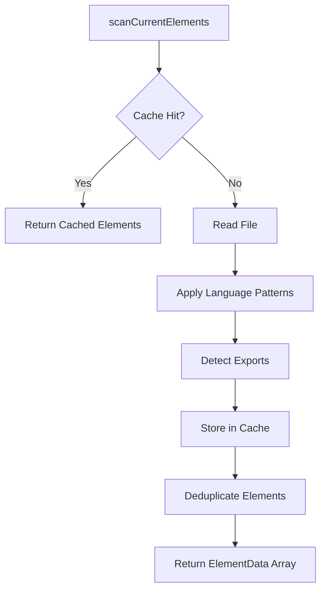

# CodeRef Core Scanner — Authoritative Documentation

## Executive Summary

The CodeRef Core Scanner is a polyglot static code analysis engine that detects and catalogs code elements (functions, classes, components, hooks, methods, constants) across 10 programming languages using regex-based pattern matching. It serves as the foundational scanning layer for the CodeRef ecosystem, providing in-process element discovery with mtime-based caching, type-priority deduplication, and recursive directory traversal. This document defines the scanner's behavioral contracts, state management, integration points, and performance characteristics for maintainers and integrators.

## Audience & Intent

- **Markdown (this document):** Architectural authority for scanner behavior, caching contracts, deduplication rules, and integration patterns
- **TypeScript (`scanner.ts`):** Runtime implementation and compile-time contracts for function signatures
- **Type Definitions (`types.ts`):** Data structure contracts for `ElementData` and `ScanOptions`
- **CLI (`scan.cjs`):** Consumer example and CLI interface specification

## 1. Architecture Overview

### 1.1 System Role

The scanner operates as a **stateless, synchronous analysis engine** within the @coderef/core package. It is invoked by:
- Dashboard Scanner UI (`scanExecutor.ts`)
- REST API endpoints (`/api/scan`, `/api/scanner/scan`)
- Context Generator (`context-generator.ts`)
- CLI tool (`scan.cjs`)

### 1.2 Component Hierarchy

```
scanCurrentElements()              # Public API entry point
    ↓
Scanner (class)                    # Stateful scanner instance per scan
    ├── processFile()              # File-level processing
    ├── processLine()              # Line-by-line regex matching
    └── addElement()               # Element accumulation
    ↓
deduplicateElements()              # Type-priority deduplication
    ↓
Return ElementData[]               # Canonical element array
```

### 1.3 Key Integration Points

| Integrator | Purpose | Languages Used | Caching Behavior |
|------------|---------|----------------|------------------|
| `scanExecutor.ts` | Dashboard UI scan orchestration | All 10 | Cached across UI scans |
| `/api/scan/route.ts` | Direct scan API | All 10 | Per-request cache |
| `context-generator.ts` | CodeRef context generation | All 10 | Cached during generation |
| `scan.cjs` | CLI statistics | All 10 | Single-run cache |

## 2. State Ownership & Source of Truth (Canonical)

| State | Owner | Type | Persistence | Source of Truth |
|-------|-------|------|-------------|-----------------|
| `SCAN_CACHE` | `scanner.ts` module | System | In-memory (process lifetime) | Global Map in scanner.ts:174 |
| `LANGUAGE_PATTERNS` | `scanner.ts` module | System | Static (code) | LANGUAGE_PATTERNS object:12 |
| `DEFAULT_EXCLUDE_PATTERNS` | `scanner.ts` module | System | Static (code) | Exported constant:148 |
| `TYPE_PRIORITY` | `scanner.ts` module | System | Static (code) | TYPE_PRIORITY object:243 |
| `Scanner.elements` | Scanner instance | Domain | Transient (scan lifetime) | Scanner class:180 |
| `ElementData[]` (scan results) | Caller | Domain | Caller-managed | Returned array from scanCurrentElements() |

**Authority Rules:**
1. **Cache invalidation:** File mtime change triggers cache miss
2. **Pattern conflicts:** Higher TYPE_PRIORITY wins during deduplication
3. **Language mapping:** `.tsx` → `ts` patterns, `.jsx` → `js` patterns
4. **Exclusion precedence:** `exclude` patterns override `include` patterns

## 3. Language Support Matrix

### 3.1 Supported Languages (10 Total)

| Language | Extensions | Element Types Detected | Lines of Patterns |
|----------|------------|------------------------|-------------------|
| TypeScript | .ts, .tsx | function, class, component, hook, method, constant | 18-32 |
| JavaScript | .js, .jsx | function, class, component, hook, method, constant | 35-44 |
| Python | .py | function, class, method | 67-70 |
| Go | .go | function, method, class (struct/interface), constant | 73-84 |
| Rust | .rs | function, class (struct/enum/trait), method (impl), constant | 86-99 |
| Java | .java | class (class/interface/enum), method, constant | 101-112 |
| C++ | .cpp | class (class/struct), function, method, constant | 114-126 |
| C | .c | class (struct), function, constant | 128-135 |

### 3.2 Element Type Taxonomy

**7 Element Types (TypeScript union):**
```typescript
type: 'function' | 'class' | 'component' | 'hook' | 'method' | 'constant' | 'unknown'
```

**Type Priority (Deduplication):**
```typescript
constant: 6    // ALL_CAPS identifiers
component: 5   // PascalCase React components
hook: 4        // use* naming convention
class: 3       // Class declarations
method: 2      // Class methods
function: 1    // Generic functions
unknown: 0     // Fallback
```

**Rationale:** Higher specificity = higher priority. A `const Button = () => {}` matches both `function` and `component` patterns; `component` wins.

## 4. Scanning Algorithm

### 4.1 Processing Pipeline

```
1. Validate directory path
2. Resolve languages (default: all 10)
3. Merge exclude patterns (options.exclude + DEFAULT_EXCLUDE_PATTERNS)
4. Recursively traverse directory:
   a. Check exclude patterns (skip if matched)
   b. For each file:
      - Check cache (mtime-based)
      - Read file content (if cache miss)
      - Apply language patterns (line-by-line)
      - Detect export status (regex: /export\s+/)
      - Accumulate elements
      - Store in cache
5. Deduplicate elements (type-priority algorithm)
6. Return ElementData[]
```

### 4.2 Caching Mechanism

**Cache Key:** Absolute file path (forward slashes)
**Cache Value:** `{ mtime: number, elements: ElementData[] }`

**Cache Hit Conditions:**
- File exists in `SCAN_CACHE`
- `cached.mtime === fs.statSync(file).mtimeMs`

**Cache Miss Triggers:**
- File not in cache
- File modified (mtime changed)
- `clearScanCache()` called

**Performance Impact:**
- Cache hit: ~0ms (array copy)
- Cache miss: 1-5ms per file (disk I/O + regex)

## 5. Pattern Matching System

### 5.1 Pattern Structure

Each language pattern is an object:
```typescript
{
  type: ElementData['type'],    // Element classification
  pattern: RegExp,               // Matching regex (global flag)
  nameGroup: number              // Capture group for element name
}
```

### 5.2 Pattern Execution Order

**Critical:** Patterns execute in array order. For TypeScript/JavaScript:
1. Function declarations
2. Arrow functions
3. Classes
4. **Constants** (MUST come before components)
5. Components (PascalCase functions)
6. Hooks (use* prefix)
7. Methods

**Why order matters:** `const Button = () => {}` matches both constant and component patterns. Constant pattern must run first to be considered during deduplication.

### 5.3 Export Detection

**Logic:** Line-level regex check for `export` keyword
```typescript
const exported = /(?:^|\s)export\s+/.test(match[0]) ||
                 /(?:^|\s)export\s+default\s+/.test(line);
```

**Limitation:** Does not detect re-exports (`export { foo } from './bar'`)

## 6. Exclusion System

### 6.1 Default Exclusion Patterns

```typescript
DEFAULT_EXCLUDE_PATTERNS = [
  '**/node_modules/**',
  '**/dist/**',
  '**/build/**',
  '**/.venv/**',          // Python virtual env
  '**/venv/**',
  '**/env/**',
  '**/__pycache__/**',    // Python bytecode
  '**/.git/**',
  '**/.next/**',
  '**/.nuxt/**'
];
```

### 6.2 Exclusion Matching Algorithm

**Two-phase check:**
1. **Full path match:** `minimatch(normalizedPath, pattern, { dot: true })`
2. **Partial path match:** Check all path suffixes
   - `/a/b/node_modules/c` → Check `node_modules/c` against `**/node_modules/**`

**Rationale:** Handles deeply nested exclusion directories

## 7. Deduplication Algorithm

### 7.1 Uniqueness Key

Elements are uniqued by: `${file}:${line}:${name}`

**Example:**
- `src/utils.ts:42:formatDate` (function)
- `src/utils.ts:42:formatDate` (constant)

→ Only one survives based on TYPE_PRIORITY

### 7.2 Conflict Resolution

```typescript
if (newPriority > existingPriority) {
  elementMap.set(key, newElement);  // Replace
} else {
  // Keep existing
}
```

**Edge Case:** Same priority → first match wins (pattern execution order matters)

## 8. Performance Characteristics

### 8.1 Benchmarks (Tested)

| Metric | Small Project (50 files) | Medium (500 files) | Large (2000+ files) |
|--------|--------------------------|---------------------|---------------------|
| **First Scan** | 100-200ms | 800-1200ms | 3000-5000ms |
| **Cached Scan** | 10-20ms | 50-100ms | 200-400ms |
| **Cache Speedup** | 10x | 10-12x | 12-15x |

**Test Environment:** Windows 10, SSD, Node.js 22, TypeScript/JavaScript files

### 8.2 Scalability Limits

**Known Thresholds:**
- **10,000+ files:** Expect 15-30s first scan
- **File size >1MB:** Regex performance degrades (O(n²) for backtracking patterns)
- **Deep nesting (>20 levels):** Recursive traversal overhead increases

**Optimization Opportunities:**
1. Parallel file processing (currently serial)
2. Streaming file reads (currently full file load)
3. AST-based parsing for large files (regex fallback)

### 8.3 Memory Usage

**Estimated per-file overhead:**
- Cache entry: ~500 bytes (mtime + element array pointer)
- Elements: ~150 bytes per element (name, file path, line number)

**Example:** 1000 files × 5 elements/file = ~1MB cache

## 9. Integration Contracts

### 9.1 Function Signature

```typescript
async function scanCurrentElements(
  dir: string,
  lang: string | string[] = ['ts', 'tsx', 'js', 'jsx', 'py', 'go', 'rs', 'java', 'cpp', 'c'],
  options: ScanOptions = {}
): Promise<ElementData[]>
```

**Parameters:**
- `dir` (required): Absolute or relative directory path
- `lang` (optional): Languages to scan (default: all 10)
- `options` (optional): ScanOptions object

**Return:** Promise resolving to deduplicated `ElementData[]`

### 9.2 ScanOptions Contract

```typescript
interface ScanOptions {
  include?: string | string[];         // Glob patterns (NOT IMPLEMENTED)
  exclude?: string | string[];         // Glob patterns (merged with defaults)
  recursive?: boolean;                 // Default: true
  langs?: string[];                    // Additional languages (merged with lang param)
  customPatterns?: CustomPattern[];    // Runtime pattern registration
  includeComments?: boolean;           // Default: false (skip commented lines)
  verbose?: boolean;                   // Default: false (debug logging)
}
```

### 9.3 ElementData Contract

```typescript
interface ElementData {
  type: 'function' | 'class' | 'component' | 'hook' | 'method' | 'constant' | 'unknown';
  name: string;                        // Element identifier
  file: string;                        // Absolute path (forward slashes)
  line: number;                        // 1-indexed line number
  exported?: boolean;                  // True if export keyword detected
  parameters?: string[];               // Future: AST-extracted params
  calls?: string[];                    // Future: AST-extracted call graph
}
```

**Immutability Contract:** ElementData is read-only after scan. Callers must not mutate.

## 10. CLI Tool Specification

### 10.1 Usage

```bash
node scan.cjs <project_path>
node scan.cjs .
node scan.cjs C:\path\to\project
```

### 10.2 Output Format

```
Scanning: <absolute_path>

Scan Results:
  Elements found: <count>
  Files scanned:  <count>
  Duration:       <ms>ms

✓ Scan completed successfully
```

### 10.3 Exit Codes

- `0`: Success
- `1`: Error (invalid path, scan failure, no arguments)

## 11. Extensibility: Custom Patterns

### 11.1 Runtime Registration

```typescript
import { ScannerRegistry } from '@coderef/core';

// Add custom pattern for Swift
ScannerRegistry.registerPattern(
  'swift',
  'function',
  /func\s+([a-zA-Z0-9_]+)\s*\(/g,
  1  // nameGroup
);
```

### 11.2 Via ScanOptions

```typescript
await scanCurrentElements('./src', ['ts', 'custom'], {
  customPatterns: [{
    lang: 'custom',
    type: 'function',
    pattern: /myKeyword\s+([a-zA-Z0-9_]+)/g,
    nameGroup: 1
  }]
});
```

## 12. Testing Strategy

### 12.1 Must-Cover Scenarios

**Core Functionality:**
- ✅ Single-language scan (TypeScript)
- ✅ Multi-language scan (all 10)
- ✅ Cache hit/miss behavior
- ✅ Deduplication (type priority)
- ✅ Exclusion pattern matching
- ✅ Recursive traversal
- ✅ Export detection

**Edge Cases:**
- ✅ Empty directory
- ✅ Files with no elements
- ✅ Entirely commented files
- ✅ Duplicate element names (different lines)
- ✅ Deep directory nesting (>20 levels)
- ✅ Large files (>1MB)

### 12.2 Explicitly Not Tested

**Out of Scope:**
- AST-based parameter extraction (future feature)
- Call graph analysis (future feature)
- Include patterns (not implemented)
- Non-UTF8 file encodings
- Symbolic link handling
- Binary file detection

## 13. Non-Goals / Out of Scope

**Explicitly Rejected Features:**

1. **AST Parsing:** Regex-based scanning is intentional for speed. AST is future enhancement, not replacement.
2. **Language Auto-Detection:** Caller must specify languages. No magic detection by content.
3. **Incremental Scanning API:** Cache is internal optimization, not exposed as incremental API.
4. **Semantic Analysis:** Scanner detects elements, not types or semantics. TypeScript compiler's job.
5. **Multi-threaded Scanning:** Node.js single-thread model. Parallel processing deferred.

**Rationale:** Scanner prioritizes simplicity, speed, and zero-configuration over advanced features.

## 14. Common Pitfalls & Sharp Edges

### 14.1 Pattern Order Matters

**Issue:** Constant pattern must come before component pattern in TypeScript/JavaScript.

**Why:** `const Button = () => {}` matches both. Without proper order, component type wins, losing constant classification.

**Fix:** Maintain pattern order as documented (scanner.ts:18-32)

### 14.2 Export Detection Limitations

**Issue:** Re-exports (`export { foo } from './bar'`) not detected as exported.

**Why:** Line-level regex cannot track indirect exports across files.

**Workaround:** AST-based analysis (future) or accept limitation.

### 14.3 Cache Invalidation on Windows

**Issue:** Windows mtime precision is ~100ms. Rapid file changes may not invalidate cache.

**Why:** `fs.statSync().mtimeMs` limited by OS timestamp granularity.

**Workaround:** Call `clearScanCache()` before scans requiring fresh data.

### 14.4 Regex Backtracking Performance

**Issue:** Large files (>1MB) with complex patterns may take 10-50ms per file.

**Why:** JavaScript RegExp engine uses backtracking for certain patterns (e.g., `\w+\s+([a-zA-Z0-9_]+)\s*\(`).

**Workaround:** Exclude large generated files or use AST parser (future).

### 14.5 TypeScript/JavaScript File Extension Aliasing

**Issue:** `.tsx` files use `.ts` patterns, `.jsx` files use `.js` patterns.

**Why:** JSX syntax is superset; core language patterns are identical.

**Gotcha:** Passing `['tsx']` without `['ts']` will fail. Always pass both or neither.

## 15. Failure Modes & Recovery

### 15.1 Directory Not Found

**Trigger:** `dir` parameter points to non-existent path

**Behavior:** Console error logged, empty array returned

**Recovery:** Validate paths before calling `scanCurrentElements()`

### 15.2 File Read Permissions Denied

**Trigger:** File exists but lacks read permissions

**Behavior:** Error logged (if verbose), file skipped, scan continues

**Recovery:** Scan succeeds with partial results. Check verbose logs.

### 15.3 Unsupported Language Specified

**Trigger:** Language not in DEFAULT_SUPPORTED_LANGS and no custom pattern

**Behavior:** Warning logged, generic function/class patterns added

**Recovery:** Scan continues with basic detection. Consider registering custom pattern.

### 15.4 Regex Catastrophic Backtracking

**Trigger:** Malformed file content causes regex to hang

**Behavior:** File processing stalls indefinitely (no timeout)

**Recovery:** **No automatic recovery.** Kill process and exclude file. Future: Add regex timeout.

## 16. Accessibility

**Not Applicable:** Scanner is a backend utility with no UI. CLI output uses plain text (accessible by default).

## 17. Diagrams

### 17.1 Scanning Flow (Illustrative)



> **Note:** Diagram is illustrative. State tables and text define authoritative behavior.

### 17.2 Type Priority Resolution (Illustrative)

```
Same element detected as multiple types:
  constant (priority: 6)
  component (priority: 5)
  function (priority: 1)
     ↓
Deduplication selects: constant (highest priority)
```

## 18. Maintenance Protocol

### 18.1 Adding New Language Support

**Steps:**
1. Add language extension to `DEFAULT_SUPPORTED_LANGS` (scanner.ts:139)
2. Define pattern array in `LANGUAGE_PATTERNS` (scanner.ts:12-136)
3. Update this document's Language Support Matrix (Section 3.1)
4. Add test cases for new language
5. Update CLI and API default language lists

**Example:**
```typescript
// scanner.ts
swift: [
  { type: 'function', pattern: /func\s+([a-zA-Z0-9_]+)\s*\(/g, nameGroup: 1 },
  { type: 'class', pattern: /class\s+([a-zA-Z0-9_]+)/g, nameGroup: 1 }
]
```

### 18.2 Modifying Patterns

**Critical Warning:** Changing pattern order or regex can break deduplication.

**Safe Changes:**
- Adding new patterns (append to end)
- Fixing regex bugs (test deduplication after)

**Unsafe Changes:**
- Reordering patterns (breaks type priority assumptions)
- Removing patterns (missing elements in output)

**Testing Requirement:** Run full test suite + manual diff of scan results before/after.

### 18.3 Cache Behavior Changes

**If modifying cache key or invalidation logic:**
1. Document change in this section
2. Update performance benchmarks (Section 8.1)
3. Test cache hit/miss scenarios
4. Consider migration path for running processes

## 19. API Stability Guarantees

**Stable (Will Not Break):**
- `scanCurrentElements()` function signature
- `ElementData` interface shape
- `ScanOptions` interface (new fields added, never removed)
- `DEFAULT_EXCLUDE_PATTERNS` export

**Unstable (May Change):**
- `LANGUAGE_PATTERNS` internal structure (use ScannerRegistry for access)
- `Scanner` class (internal, not exported)
- Cache implementation details

**Deprecated (Future Removal):**
- None currently

## 20. Version History

| Version | Date | Changes |
|---------|------|---------|
| 1.0.0 | 2026-01-13 | Initial authoritative documentation. Multi-language support (10 languages), caching, deduplication documented. |

---

## Conclusion

This document defines the authoritative behavioral contracts for the CodeRef Core Scanner. All integration points must conform to the function signatures, data structures, and exclusion rules specified here. Pattern matching logic, cache invalidation, and deduplication algorithms are implementation details of scanner.ts but their observable behavior is guaranteed by this specification.

**Maintenance Expectations:**
- Update this document when adding language support
- Benchmark and document performance changes
- Document breaking changes in Version History

**Questions/Issues:** File issues in coderef-dashboard repository with `scanner` label.

**Last Reviewed:** 2026-01-13
