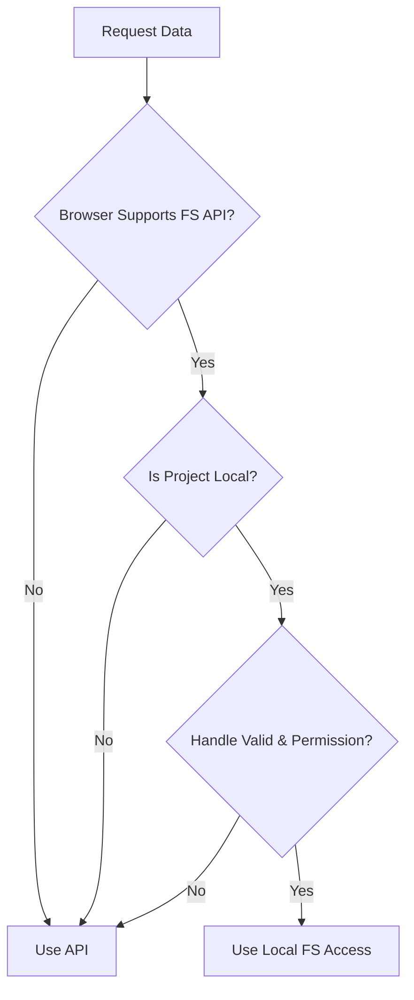

# Hybrid Router - Resource Sheet

**Category:** Core Logic
**Type:** Library Module
**File:** `packages/dashboard/src/lib/coderef/hybrid-router.ts`
**Created:** 2026-01-04
**Lines of Code:** ~150
**Complexity:** High

---

**Generated by:** Resource Sheet Generation Workflow
**Timestamp:** 2026-01-04
**Auto-fill Rate:** Manual (comprehensive analysis)

---

## Executive Summary

**Element:** Hybrid Router
**Category:** Core Logic
**Purpose:** Intelligent routing layer that abstracts the difference between Local (File System Access API) and API (Next.js/Electron) data access. It prioritizes direct local access for performance and capability (editing), falling back to API routes when necessary.

**Key Responsibilities:**
- Determining if the browser supports File System Access API.
- Checking validity and permissions of IndexedDB file handles.
- Routing requests to `local-access.ts` (Direct) or `api-access.ts` (HTTP).
- Providing `loadProjectTree` and `loadFileContent` unified methods.
- Exposing `getProjectAccessMode` for UI indicators.

**Not Responsible For:**
- The actual API implementation (delegated to `api-access`).
- The actual File System implementation (delegated to `local-access`).
- UI rendering.

---

## Architecture Overview

### Logic Flow

**Prioritization:**
1.  **Local (Direct):** Fastest, enables writing, zero network latency.
2.  **API (Fallback):** Works everywhere (browsers without FS API, Electron without handles), read-only (mostly).

### Key Functions

**1. `loadProjectTree(project)`**
- Tries to get directory handle from IndexedDB (`project.id`).
- If valid, calls `buildTreeFromHandle` (recursive scan).
- If invalid/fail, calls `CodeRefApi.tree.load`.
- Returns `{ data: TreeNode[], mode: 'local' | 'api' }`.

**2. `loadFileContent(project, filePath)`**
- Tries to get file handle via `getFileHandleByPath`.
- If found, reads directly via `loadFileFromHandle`.
- If fail, calls `CodeRefApi.file.load`.
- Returns `{ data: FileInfo, mode: 'local' | 'api' }`.

**3. `getProjectAccessMode(project)`**
- Diagnostic function to check *current* capability.
- Returns `'local'` only if handle exists, is valid, AND has read permission.
- Otherwise returns `'api'`.

---

## Integration Points

- **Consumers:**
  - `CodeRefExplorerWidget` (via `FileTree` and `ProjectSelector`).
  - `FileViewer`.
- **Dependencies:**
  - `indexeddb`: Handle storage.
  - `permissions`: Permission verification logic.
  - `local-access`: Physical file reading.
  - `api-access`: Fallback HTTP client.

---

## Common Pitfalls

1.  **Stale Handles:** Browser security may invalidate handles on reload or browser restart. The router catches this (`verifyHandleValid`) and seamlessly falls back to API, but the user loses "Local" status (indicated by icon in `FileViewer`).
2.  **Path Formats:** Local handles work relative to the root handle. API works with absolute paths. The router handles translation, but manual path manipulation is risky.
3.  **Permissions:** "Local" mode strictly requires `read` permission. If the user dismisses the prompt, it downgrades to API.

---

**Complexity Score:** High (Logic branching, browser capability detection, fallback strategies)
**Modules Used:** indexeddb, permissions, api-access, local-access
