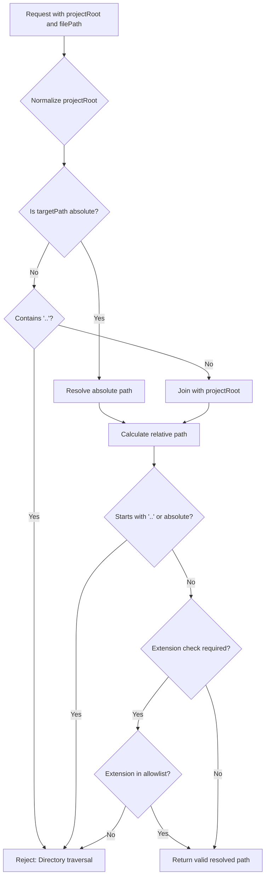
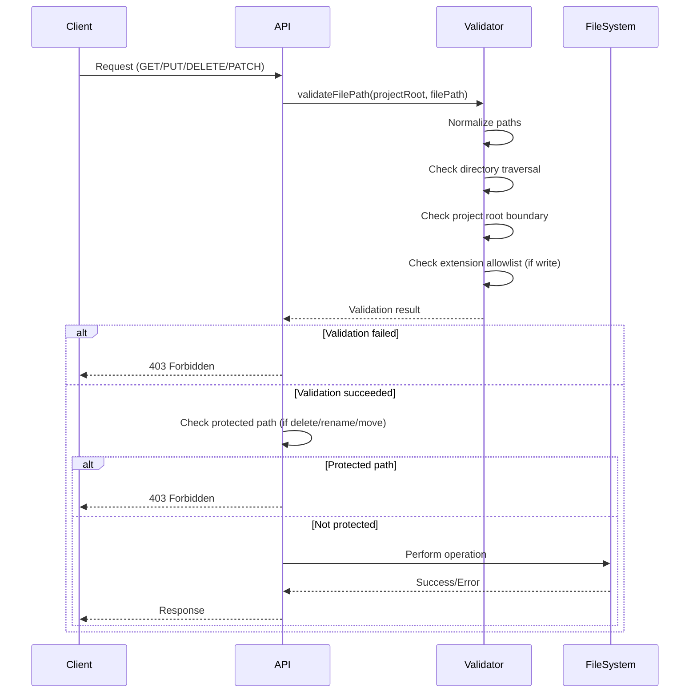

# File API Route — Authoritative Documentation

## Executive Summary

The File API Route (`/api/coderef/file`) is a security-critical Next.js API route that provides file system operations (read, write, delete, rename/move) for files within registered CodeRef project directories. The route implements comprehensive security validation to prevent directory traversal attacks, enforces file size limits and extension allowlists, protects critical system files from modification, and provides cross-platform path handling. The route serves as the primary interface for file operations in the CodeRef Dashboard, supporting the Notepad Clone widget and other file editing features.

## Audience & Intent

- **Markdown (this document):** Defines security validation rules, path resolution logic, protected paths, error contracts, and operation behaviors. This is the authoritative source for understanding file operation security, validation precedence, and attack vector mitigations.
- **TypeScript/Code:** Enforces compile-time contracts via request/response types and runtime behavior through validation functions and error handling.
- **API Contracts:** HTTP method handlers (GET, PUT, DELETE, PATCH) define request/response schemas and status codes.

## 1. Architecture Overview

### Route Structure

```
/api/coderef/file
├── GET    - Read file content and metadata
├── PUT    - Write/create file
├── DELETE - Delete file or directory
└── PATCH  - Rename or move file/directory
```

### Key Components

- **validateFilePath():** Unified path validation function (security-critical)
- **isProtectedPath():** Protected path check (prevents deletion of critical files)
- **isValidFileName():** File name validation for rename operations
- **isTextFile():** Text file detection for encoding decisions
- **getMimeType():** MIME type detection from file extension

### Role in System

The File API Route serves as the **security boundary** for file operations:
1. **Path Validation:** Ensures all paths are within project root (prevents directory traversal)
2. **Extension Allowlisting:** Restricts write operations to safe file types
3. **Size Limits:** Prevents large file uploads that could cause DoS
4. **Protected Paths:** Prevents deletion/modification of critical system files
5. **Cross-Platform:** Handles Windows and Unix path differences

## 2. State Ownership & Source of Truth (Canonical)

| State | Owner | Type | Persistence | Source of Truth |
|-------|-------|------|-------------|-----------------|
| File Content | File System | Domain | File System | Actual file on disk |
| File Metadata | File System | Domain | File System | `fs.stat()` results |
| Project Root | Request Body | Input | None (per-request) | `projectRoot` parameter |
| Validation Rules | Route Code | System | None (hardcoded) | `validateFilePath()` function |
| Protected Paths | Route Code | System | None (hardcoded) | `PROTECTED_PATHS` constant |

### State Ownership Rules

1. **File System Authority:** The file system is the source of truth for file content and metadata. The API route never caches or modifies file data except through explicit write operations.

2. **Path Resolution:** All paths are resolved relative to `projectRoot`. The `validateFilePath()` function normalizes and validates paths before any file operation.

3. **Validation Precedence:** Security validation occurs in this order:
   - Path normalization (resolve absolute/relative paths)
   - Directory traversal check (`..` detection)
   - Project root boundary check
   - Extension allowlist check (for writes)
   - Protected path check (for delete/rename/move)
   - File existence check (for read/delete/rename/move)

4. **Error Responses:** Error state is not persisted. Each request is independent and returns appropriate HTTP status codes.

5. **No Client State:** The route is stateless. No session state, caching, or client-specific data is maintained.

## 3. Data Persistence

### File System Operations

**Read (GET):**
- Reads file content from disk
- Returns content as UTF-8 (text files) or base64 (binary files)
- No modification to file system

**Write (PUT):**
- Creates new file or overwrites existing file
- Writes content to disk immediately
- Creates parent directories if they don't exist

**Delete (DELETE):**
- Removes file or directory from disk
- Recursive deletion for directories (if `recursive: true`)
- Permanent operation (no undo)

**Rename/Move (PATCH):**
- Renames file in same directory (operation: 'rename')
- Moves file to different directory (operation: 'move')
- Uses `fs.rename()` (atomic operation when possible)

### Storage Location

Files are stored within the project root directory specified in the request:
- **Project Root:** Absolute path provided in `projectRoot` request parameter
- **File Path:** Relative or absolute path within project root
- **Validation:** All paths must resolve within project root boundary

### File Size Limits

| Operation | Limit | Rationale |
|-----------|-------|-----------|
| Write (PUT) | 1MB | Prevents DoS attacks and memory exhaustion |
| Read (GET) | 10MB | Prevents large file downloads from blocking API |

**Enforcement:**
- Write: Content length checked before write operation
- Read: File size checked before reading content

## 4. State Lifecycle

### GET Request Flow

1. **Request:** `GET /api/coderef/file?path=<file-path>`
2. **Path Validation:** `validateFilePath()` validates path is within project root
3. **File Existence:** `fs.stat()` checks file exists and is a file (not directory)
4. **Size Check:** File size must be ≤ 10MB
5. **Content Reading:**
   - Text files: `fs.readFile(path, 'utf-8')`
   - Binary files: `fs.readFile(path)` → base64 encoding
6. **Response:** Returns `FileData` object with content and metadata

### PUT Request Flow

1. **Request:** `PUT /api/coderef/file` with `{ projectRoot, filePath, content }`
2. **Validation:**
   - Required fields check
   - Content size check (≤ 1MB)
   - Path validation with extension allowlist
3. **Directory Creation:** Parent directories created if needed (`fs.mkdir` with `recursive: true`)
4. **File Write:** `fs.writeFile()` writes content to disk
5. **Response:** Returns success with file path

### DELETE Request Flow

1. **Request:** `DELETE /api/coderef/file` with `{ projectRoot, filePath, recursive? }`
2. **Validation:**
   - Required fields check
   - Path validation
   - Protected path check
   - File existence check
3. **Directory Check:** If directory and `recursive !== true`, reject
4. **Deletion:**
   - File: `fs.unlink(path)`
   - Directory: `fs.rm(path, { recursive: true, force: true })`
5. **Response:** Returns success with deleted path

### PATCH Request Flow

1. **Request:** `PATCH /api/coderef/file` with `{ projectRoot, sourcePath, operation, newName?, destinationDir? }`
2. **Validation:**
   - Required fields check
   - Operation type check ('rename' or 'move')
   - Source path validation
   - Protected path check
   - Source existence check
3. **Operation-Specific Validation:**
   - Rename: `newName` validation (no slashes, no `..`, not empty, not reserved)
   - Move: Destination directory validation and existence check
4. **Destination Validation:**
   - Destination must not exist (409 Conflict if exists)
   - Cannot move directory into itself
   - Cannot move to same location
5. **Rename/Move:** `fs.rename(sourcePath, destinationPath)`
6. **Response:** Returns success with old and new paths

## 5. Behaviors (Events & Side Effects)

### Security Behaviors

| Security Check | Trigger | Handler | Side Effects |
|----------------|---------|---------|-------------|
| Directory Traversal | Path contains `..` | `validateFilePath()` | Request rejected (403 Forbidden) |
| Path Boundary | Path escapes project root | `validateFilePath()` | Request rejected (403 Forbidden) |
| Extension Allowlist | Write operation with disallowed extension | `validateFilePath()` | Request rejected (403 Forbidden) |
| Protected Path | Delete/rename/move of protected file | `isProtectedPath()` | Request rejected (403 Forbidden) |
| File Size Limit | Content exceeds 1MB (write) or 10MB (read) | Size check | Request rejected (413 Payload Too Large or 400 Bad Request) |

### File Operation Behaviors

| Operation | Trigger | Handler | Side Effects |
|-----------|---------|---------|--------------|
| Read File | GET request | `fs.readFile()` | None (read-only) |
| Write File | PUT request | `fs.writeFile()` | File created/overwritten on disk |
| Delete File | DELETE request | `fs.unlink()` or `fs.rm()` | File removed from disk |
| Rename File | PATCH request (operation: 'rename') | `fs.rename()` | File renamed on disk |
| Move File | PATCH request (operation: 'move') | `fs.rename()` | File moved to new location |

### Error Behaviors

| Error Type | Trigger | Handler | Side Effects |
|------------|---------|---------|--------------|
| File Not Found | File doesn't exist | Error response | 404 Not Found |
| Permission Denied | File system permission error | Error response | 403 Forbidden |
| Path Validation Failed | Invalid path | Error response | 403 Forbidden |
| Size Limit Exceeded | Content too large | Error response | 413 Payload Too Large |
| Protected Path | Attempt to modify protected file | Error response | 403 Forbidden |
| Cross-Device Move | Move across filesystems | Error response | 400 Bad Request |

## 6. Event & Callback Contracts

### GET Request Contract

**Request:**
```
GET /api/coderef/file?path=<absolute-file-path>
```

**Response (Success):**
```typescript
{
  success: true,
  data: {
    path: string;           // Absolute file path
    name: string;           // File name
    extension: string;      // File extension (e.g., '.md')
    size: number;           // File size in bytes
    content: string;        // File content (UTF-8 or base64)
    encoding: 'utf-8' | 'base64';
    mimeType: string;       // MIME type
    lastModified: string;   // ISO 8601 timestamp
  }
}
```

**Response (Error):**
- `400 Bad Request`: Missing `path` parameter
- `403 Forbidden`: Path validation failed
- `404 Not Found`: File not found
- `413 Payload Too Large`: File size > 10MB
- `500 Internal Server Error`: Unexpected error

### PUT Request Contract

**Request:**
```typescript
{
  projectRoot: string;     // Absolute path to project root
  filePath: string;         // Relative or absolute path within project
  content: string;          // File content (UTF-8 string)
}
```

**Response (Success):**
```typescript
{
  success: true,
  data: {
    path: string;           // Resolved absolute file path
  }
}
```

**Response (Error):**
- `400 Bad Request`: Missing required fields or content too large
- `403 Forbidden`: Path validation failed or extension not allowed
- `500 Internal Server Error`: File write failed

### DELETE Request Contract

**Request:**
```typescript
{
  projectRoot: string;     // Absolute path to project root
  filePath: string;         // Relative or absolute path within project
  recursive?: boolean;     // Allow directory deletion (default: false)
}
```

**Response (Success):**
```typescript
{
  success: true,
  data: {
    deleted: string;        // Resolved absolute path that was deleted
    type: 'file' | 'directory';
  }
}
```

**Response (Error):**
- `400 Bad Request`: Missing required fields or directory without `recursive`
- `403 Forbidden`: Path validation failed or protected path
- `404 Not Found`: File/directory not found
- `500 Internal Server Error`: Deletion failed

### PATCH Request Contract

**Request (Rename):**
```typescript
{
  projectRoot: string;
  sourcePath: string;
  operation: 'rename';
  newName: string;          // New file name (no path)
}
```

**Request (Move):**
```typescript
{
  projectRoot: string;
  sourcePath: string;
  operation: 'move';
  destinationDir: string;   // Destination directory path
}
```

**Response (Success):**
```typescript
{
  success: true,
  data: {
    operation: 'rename' | 'move';
    oldPath: string;        // Original path
    newPath: string;        // New path
    type: 'file' | 'directory';
  }
}
```

**Response (Error):**
- `400 Bad Request`: Missing required fields, invalid operation, invalid name, or cross-device move
- `403 Forbidden`: Path validation failed or protected path
- `404 Not Found`: Source file/directory not found
- `409 Conflict`: Destination already exists
- `500 Internal Server Error`: Rename/move failed

## 7. Security Validation Rules

### Path Validation (validateFilePath)

**Input:**
- `projectRoot`: Absolute path to project root
- `targetPath`: Relative or absolute path to validate
- `options`: `{ requireExtension?: boolean; allowedExtensions?: Set<string> }`

**Validation Steps (in order):**

1. **Normalize Project Root:**
   ```typescript
   const normalizedRoot = path.resolve(projectRoot);
   ```

2. **Resolve Target Path:**
   - If absolute: Use `path.resolve(targetPath)` directly
   - If relative: Check for `..` in path → reject if found
   - Join with project root: `path.resolve(normalizedRoot, targetPath)`

3. **Boundary Check:**
   ```typescript
   const relativePath = path.relative(normalizedRoot, resolvedPath);
   const isWithinRoot = !relativePath.startsWith('..') && !path.isAbsolute(relativePath);
   ```
   - Reject if path escapes project root

4. **Extension Check (if required):**
   - Extract extension: `path.extname(resolvedPath).toLowerCase()`
   - Check against `allowedExtensions` set
   - Reject if extension not allowed

**Output:**
```typescript
{
  valid: boolean;
  error?: string;
  resolvedPath?: string;  // Absolute resolved path
}
```

### Protected Paths

**Protected Path List:**
```typescript
const PROTECTED_PATHS = new Set([
  '.git',
  'node_modules',
  'package.json',
  'package-lock.json',
  '.env',
  '.env.local',
  '.env.production',
]);
```

**Check Logic:**
```typescript
function isProtectedPath(filePath: string): boolean {
  const basename = path.basename(filePath);
  return PROTECTED_PATHS.has(basename);
}
```

**Protected Operations:**
- DELETE: Cannot delete protected files/directories
- PATCH: Cannot rename or move protected files/directories
- PUT: Protected files can be overwritten (by design, for `.env` editing)

### File Name Validation (isValidFileName)

**Rules:**
1. No slashes: Reject if contains `/` or `\`
2. No directory traversal: Reject if contains `..`
3. Not empty: Reject if `trim() === ''`
4. Not reserved (Windows): Reject if matches Windows reserved names:
   - `CON`, `PRN`, `AUX`, `NUL`
   - `COM1-4`, `LPT1-3`

**Usage:** Only for rename operations (new file name validation)

### Extension Allowlist (Write Operations)

**Allowed Extensions:**
```typescript
const WRITE_ALLOWED_EXTENSIONS = new Set([
  // Markdown and text
  '.md', '.txt',
  // Web development
  '.html', '.htm', '.css', '.scss', '.sass', '.js', '.jsx', '.ts', '.tsx',
  // Programming languages
  '.py', '.java', '.c', '.cpp', '.rs', '.go', '.rb', '.php',
  // Data and config
  '.json', '.yaml', '.yml', '.toml', '.ini', '.env',
  // Markup and data
  '.xml', '.svg',
  // Database and scripts
  '.sql', '.sh', '.bash',
]);
```

**Enforcement:** Only for PUT (write) operations. GET (read) operations allow any file type.

## 8. Performance Considerations

### Known Limits

- **Write Size:** 1MB maximum content size
- **Read Size:** 10MB maximum file size
- **Concurrent Requests:** No explicit limit (Next.js handles concurrency)
- **Path Resolution:** O(1) for path validation (Set lookups)

### Bottlenecks

1. **Large File Reads:** Reading files > 1MB can block the API route (10MB limit prevents worst case)
2. **Recursive Directory Deletion:** Deleting large directory trees can be slow (no progress reporting)
3. **Cross-Device Moves:** Moving files across filesystems fails (EXDEV error)

### Optimization Opportunities

- **Streaming:** Stream large file reads instead of loading into memory (future optimization)
- **Async Directory Operations:** Use worker threads for large directory operations (future optimization)
- **Caching:** Cache file metadata (mtime, size) for frequently accessed files (future optimization)

### Deferred Optimizations

- **File Watching:** Real-time file change notifications not implemented
- **Batch Operations:** No batch file operations (create/delete multiple files at once)
- **Compression:** No compression for large file transfers

## 9. Accessibility

### Current Gaps

| Issue | Severity | Description |
|-------|----------|-------------|
| No error announcements | Minor | API errors not announced to screen readers (client-side concern) |
| No operation feedback | Minor | No progress indicators for long operations (client-side concern) |

### Required Tasks

1. **Priority 3:** Client-side components should announce file operation results to screen readers

**Note:** API routes are server-side and don't directly interact with screen readers. Accessibility concerns are primarily client-side.

## 10. Testing Strategy

### Must-Cover Scenarios

1. **Path Validation:**
   - Directory traversal attempts (`../`, `../../`)
   - Paths outside project root
   - Absolute paths within project root
   - Relative paths within project root
   - Extension allowlist enforcement (write operations)

2. **GET Operations:**
   - Read text file (UTF-8 encoding)
   - Read binary file (base64 encoding)
   - File not found (404)
   - File too large (413)
   - Permission denied (403)

3. **PUT Operations:**
   - Create new file
   - Overwrite existing file
   - Create parent directories
   - Content too large (400)
   - Invalid extension (403)
   - Path validation failure (403)

4. **DELETE Operations:**
   - Delete file
   - Delete directory (recursive)
   - Delete directory without recursive flag (400)
   - Protected path deletion (403)
   - File not found (404)

5. **PATCH Operations (Rename):**
   - Rename file
   - Rename directory
   - Invalid file name (slashes, `..`, empty, reserved)
   - Same name (400)
   - Protected path (403)
   - Destination exists (409)

6. **PATCH Operations (Move):**
   - Move file to different directory
   - Move directory to different location
   - Move into itself (400)
   - Move to same location (400)
   - Cross-device move (400)
   - Protected path (403)
   - Destination exists (409)

7. **Protected Paths:**
   - Attempt to delete `.git` (403)
   - Attempt to delete `node_modules` (403)
   - Attempt to rename `package.json` (403)
   - Overwrite `.env` (allowed for PUT)

8. **Error Handling:**
   - File system permission errors (403)
   - File system errors (500)
   - Invalid request body (400)
   - Missing required fields (400)

### Explicitly Not Tested

- **File System Performance:** Large file operations (tested separately if needed)
- **Concurrent Operations:** Race conditions between simultaneous requests (handled by file system)
- **Network Timeouts:** Network-level timeouts (handled by Next.js)

## 11. Non-Goals / Out of Scope

The following features are explicitly **not** part of File API Route v1.0:

1. **File Watching:** No real-time file change notifications
2. **Batch Operations:** No batch create/delete/rename operations
3. **File Compression:** No compression for file transfers
4. **File Search:** No file search or filtering functionality
5. **File Metadata:** No custom metadata storage (only file system metadata)
6. **File Versioning:** No version history or undo capability
7. **File Permissions:** No fine-grained permission system (all-or-nothing)
8. **File Locking:** No file locking to prevent concurrent modifications
9. **File Streaming:** No streaming for large files (loads entire file into memory)
10. **File Encryption:** No encryption for file content

## 12. Common Pitfalls & Sharp Edges

### Known Issues

1. **Cross-Device Moves:**
   - **Issue:** `fs.rename()` fails with EXDEV error when moving across filesystems
   - **Impact:** Move operation fails with 400 error
   - **Mitigation:** Error message suggests using copy instead (copy not implemented)

2. **Directory Deletion:**
   - **Issue:** Deleting large directory trees can be slow (no progress reporting)
   - **Impact:** API request may timeout for very large directories
   - **Mitigation:** Consider implementing async deletion with progress tracking (future)

3. **Concurrent Writes:**
   - **Issue:** Multiple simultaneous writes to same file can cause race conditions
   - **Impact:** Last write wins, earlier writes may be lost
   - **Mitigation:** Client-side should prevent concurrent writes (not API responsibility)

4. **Path Normalization:**
   - **Issue:** Windows and Unix path separators handled differently
   - **Impact:** Paths may resolve differently on different platforms
   - **Mitigation:** `path.resolve()` and `path.join()` handle platform differences correctly

5. **Protected Path Overwrite:**
   - **Issue:** Protected paths can be overwritten via PUT (by design for `.env` editing)
   - **Impact:** Users can modify protected files if they have write access
   - **Mitigation:** Protected paths only prevent DELETE and PATCH operations

### Integration Gotchas

1. **Project Root Required:**
   - All requests must include `projectRoot` parameter
   - Paths are validated relative to project root
   - Absolute paths outside project root are rejected

2. **Extension Case Sensitivity:**
   - Extensions are converted to lowercase before validation
   - `.MD` and `.md` are treated as same extension

3. **File Encoding:**
   - Text files read/written as UTF-8
   - Binary files read/written as base64
   - No encoding detection (relies on extension-based text file detection)

4. **Error Response Format:**
   - All errors use `createErrorResponse()` helper
   - Error codes defined in `ErrorCodes` enum
   - HTTP status codes match error severity

### Security Considerations

1. **Directory Traversal:**
   - Always validate paths with `validateFilePath()` before operations
   - Never trust user-provided paths without validation
   - Use `path.relative()` to detect path escapes

2. **Extension Allowlisting:**
   - Only allow safe file extensions for write operations
   - Reject executable files (`.exe`, `.sh`, `.bat`) unless explicitly allowed
   - Consider file content validation in addition to extension (future)

3. **Protected Paths:**
   - Protected paths list should be reviewed and updated as needed
   - Consider making protected paths configurable (future)

4. **File Size Limits:**
   - Enforce size limits to prevent DoS attacks
   - Consider per-user or per-project size limits (future)

5. **Path Normalization:**
   - Always normalize paths before validation
   - Use `path.resolve()` to handle absolute/relative path differences
   - Be aware of platform-specific path separator differences

## 13. Diagrams (Optional)

### Path Validation Flow



**Note:** Diagrams are **illustrative**, not authoritative. Validation logic in code defines truth.

### File Operation Security Flow



**Note:** Diagrams are **illustrative**, not authoritative. Security validation code defines truth.

## Conclusion

The File API Route is a production-ready, security-critical API endpoint that provides safe file system operations within project boundaries. The route implements comprehensive security validation to prevent directory traversal attacks, enforces file size and extension restrictions, and protects critical system files from accidental modification.

**Maintenance Expectations:**
- This document defines the authoritative contracts for path validation, security rules, and operation behaviors
- Future enhancements (streaming, batch operations) must not compromise security validation
- Protected paths list should be reviewed periodically and updated as needed
- Security validation logic is critical and must not be modified without security review

**Usage:**
- Developers implementing file operations must reference this document for security validation rules and error contracts
- Security reviewers must verify compliance with path validation and protected path rules
- Testers must cover all "Must-Cover Scenarios" including security attack vectors before release
