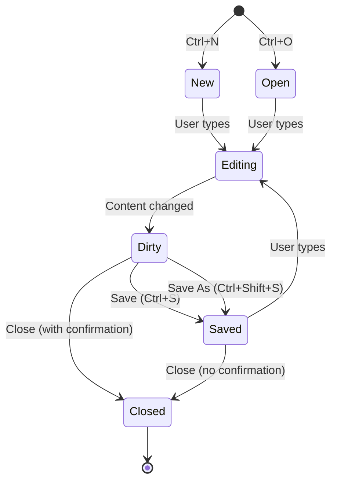

# Notepad Clone — Authoritative Documentation

## Executive Summary

The Notepad Clone is a multi-tab text editor widget that provides Microsoft Notepad-style functionality within the CodeRef Dashboard. The system enables users to open, edit, and save multiple text files simultaneously with full keyboard shortcut support, unsaved changes tracking, and cross-platform file operations (Electron and Web). The component serves as the primary text editing interface for the dashboard, replacing the previous 3-card notes widget with a production-ready tab-based editor.

## Audience & Intent

- **Markdown (this document):** Defines architectural truth, state ownership, behavior contracts, and integration patterns. This is the authoritative source for understanding tab lifecycle, file operations, and component responsibilities.
- **TypeScript/Code:** Enforces compile-time contracts via interfaces (`NotepadTab`, `FileMenuAction`, `EditMenuAction`) and runtime behavior through hook implementations and component logic.
- **JSON Schemas:** Not applicable (no external schema validation required).

## 1. Architecture Overview

### Component Hierarchy

```
NotesWidget (Main Container)
├── MenuBar
│   ├── File Menu (New, Open, Save, Save As, Close Tab)
│   └── Edit Menu (Undo, Redo, Cut, Copy, Paste, Select All)
├── TabBar
│   └── Tab[] (one per open file)
├── Preview Toggle Bar (Edit/Preview mode, New Window button)
├── EditorArea
│   ├── Textarea (edit mode)
│   └── SyntaxHighlighter (preview mode)
├── Status Bar (file path, extension, unsaved indicator, line/char count)
└── Close Confirmation Dialog (for unsaved changes)
```

### Key Integration Points

- **ProjectsContext:** Provides `projectRoot` for file operations via `useProjects()` hook
- **CodeRefApi.file:** File system operations (save, load) via `/api/coderef/file` endpoint
- **FilePicker:** Cross-platform file dialogs (Electron IPC or File System Access API)
- **Electron IPC:** Optional `electronAPI` for desktop-specific features (always on top, new window)

### Layout Structure

The widget uses a vertical flex layout:
1. **MenuBar** (fixed height, top)
2. **TabBar** (fixed height, below menu)
3. **Preview Toggle Bar** (fixed height, conditional on active tab)
4. **EditorArea** (flex-1, fills remaining space)
5. **Status Bar** (fixed height, bottom, conditional on active tab)

## 2. State Ownership & Source of Truth (Canonical)

| State | Owner | Type | Persistence | Source of Truth |
|-------|-------|------|-------------|-----------------|
| `tabs` | `useNotepadTabs` hook | Domain | None (in-memory) | `useState<NotepadTab[]>` |
| `activeTabId` | `useNotepadTabs` hook | Domain | None (in-memory) | `useState<string \| null>` |
| `activeTab` | `useNotepadTabs` hook (derived) | Domain | None (computed) | `tabs.find(t => t.id === activeTabId)` |
| `tab.content` | `useNotepadTabs` hook | Domain | None (in-memory) | `NotepadTab.content` |
| `tab.isDirty` | `useNotepadTabs` hook | Domain | None (in-memory) | `NotepadTab.isDirty` |
| `tab.filePath` | `useNotepadTabs` hook | Domain | None (in-memory) | `NotepadTab.filePath` |
| `saving` | `NotesWidget` component | UI | None | `useState<boolean>` |
| `showCloseConfirm` | `NotesWidget` component | UI | None | `useState<string \| null>` |
| `previewMode` | `NotesWidget` component | UI | None | `useState<boolean>` |
| `alwaysOnTop` | `NotesWidget` component | UI | None | `useState<boolean>` |
| `projectRoot` | `ProjectsContext` | System | IndexedDB (via ProjectsContext) | `projects[0]?.path` |

### State Ownership Rules

1. **Tab State:** The `useNotepadTabs` hook owns all tab-related state. Components must use hook methods (`createTab`, `updateContent`, `markAsSaved`, `closeTab`) to modify tabs. Direct state mutation is forbidden.

2. **UI State:** Component-level UI state (`saving`, `previewMode`, `showCloseConfirm`) is owned by `NotesWidget` and must not be shared across components.

3. **File Paths:** File paths are relative to project root (e.g., `"coderef/notes/todo.md"`). The `getNotePath()` helper normalizes paths to ensure they include the `coderef/notes/` prefix when needed.

4. **Dirty State:** A tab is marked dirty (`isDirty: true`) when content changes and `filePath !== null`. New tabs without a file path are not marked dirty until saved.

5. **Active Tab:** Only one tab can be active at a time. Closing the active tab automatically switches to the next available tab (or previous if at end, or null if no tabs remain).

## 3. Data Persistence

### Current Implementation: No Persistence

The Notepad Clone does **not** persist tab state to localStorage or any external storage. All tabs are in-memory only and are lost on page refresh.

**Rationale:**
- Tabs represent open files, not saved files
- File content is persisted via file system operations (Save)
- Tab state restoration would require complex file system access on mount
- Users can reopen files via Open menu

### Future Persistence (Non-Goal)

Tab state persistence is explicitly **out of scope** for v1.0. Future versions may add:
- localStorage backup of unsaved content
- Tab restoration on page reload
- Session management

## 4. State Lifecycle

### Tab Creation

1. **User Action:** New (Ctrl+N) or Open (Ctrl+O)
2. **Hook Call:** `createTab(filePath?, content?, extension?)`
3. **ID Generation:** `generateTabId()` creates unique ID: `tab-${Date.now()}-${random}`
4. **State Update:** New `NotepadTab` added to `tabs` array
5. **Active Tab:** `activeTabId` set to new tab ID
6. **Initial State:**
   - `isDirty: false` (new tabs) or `false` (opened files)
   - `filePath: null` (new) or provided path (open)
   - `content: ''` (new) or file content (open)

### Content Update

1. **User Action:** Typing in textarea
2. **Event:** `onChange` → `handleContentChange()`
3. **Hook Call:** `updateContent(tabId, newContent)`
4. **State Update:** Tab content updated, `isDirty` set to `true` if `filePath !== null`

### Save Operation

1. **User Action:** Save (Ctrl+S) or Save As (Ctrl+Shift+S)
2. **Path Normalization:** `getNotePath()` ensures path includes `coderef/notes/` prefix
3. **API Call:** `CodeRefApi.file.save(projectRoot, normalizedPath, content)`
4. **Hook Call:** `markAsSaved(tabId, normalizedPath)`
5. **State Update:**
   - `filePath` updated to normalized path
   - `isDirty` set to `false`
   - `lastSaved` set to current ISO timestamp
   - `title` and `fileExtension` updated from path

### Tab Close

1. **User Action:** Close tab (Ctrl+W or X button)
2. **Dirty Check:** If `tab.isDirty === true`, show confirmation dialog
3. **User Choice:**
   - **Save:** `saveBeforeClose()` → Save → Close
   - **Don't Save:** `confirmCloseTab()` → Close immediately
   - **Cancel:** Dialog dismissed, tab remains open
4. **State Update:** Tab removed from `tabs` array
5. **Active Tab Switch:** If closing active tab, switch to next/previous tab or null

## 5. Behaviors (Events & Side Effects)

### User Behaviors

| Action | Trigger | Handler | Side Effects |
|--------|---------|---------|--------------|
| New File | Ctrl+N or File → New | `handleFileAction('new')` | Creates new tab, sets active |
| Open File | Ctrl+O or File → Open | `handleFileAction('open')` | FilePicker dialog, creates tab with content |
| Save | Ctrl+S or File → Save | `handleSave()` | Saves to filePath, marks clean |
| Save As | Ctrl+Shift+S or File → Save As | `handleSaveAs()` | FilePicker dialog, saves to new path |
| Close Tab | Ctrl+W or X button | `handleCloseTab()` | Shows confirmation if dirty, closes tab |
| Type in Editor | Textarea onChange | `handleContentChange()` | Updates tab content, marks dirty |
| Switch Tab | Click tab | `switchTab(tabId)` | Changes activeTabId |
| Undo | Ctrl+Z or Edit → Undo | `document.execCommand('undo')` | Browser native undo |
| Redo | Ctrl+Y or Edit → Redo | `document.execCommand('redo')` | Browser native redo |
| Cut | Ctrl+X or Edit → Cut | Clipboard API + content update | Removes selection, updates content |
| Copy | Ctrl+C or Edit → Copy | Clipboard API | Copies selection to clipboard |
| Paste | Ctrl+V or Edit → Paste | Clipboard API + content update | Inserts clipboard content |
| Select All | Ctrl+A or Edit → Select All | `textarea.select()` | Selects all text |
| Toggle Preview | Edit/Preview buttons | `setPreviewMode()` | Switches between textarea and SyntaxHighlighter |
| Always On Top | Checkbox (Electron only) | `handleToggleAlwaysOnTop()` | Electron IPC call to set window property |
| New Window | New Window button | `handleOpenInNewWindow()` | Opens `/notes-standalone` route or Electron window |

### System Behaviors

| Event | Trigger | Handler | Side Effects |
|-------|---------|---------|--------------|
| Window Before Unload | Browser tab/window close | `beforeunload` event listener | Shows browser warning if `hasUnsavedChanges()` |
| File Save Success | API response | `markAsSaved()` | Updates tab state, clears dirty flag |
| File Save Error | API error | Error alert | Tab remains dirty, save state unchanged |
| File Open Success | FilePicker result | `createTab()` | New tab created with file content |
| File Open Error | FilePicker error | Error alert | No tab created |

## 6. Event & Callback Contracts

### MenuBar Props

| Prop | Type | Required | Description |
|------|------|----------|-------------|
| `onFileAction` | `(action: FileMenuAction) => void` | Yes | Called when File menu item clicked |
| `onEditAction` | `(action: EditMenuAction) => void` | Yes | Called when Edit menu item clicked |
| `canSave` | `boolean` | No | Disables Save menu item when false |
| `canClose` | `boolean` | No | Disables Close Tab menu item when false |

### TabBar Props

| Prop | Type | Required | Description |
|------|------|----------|-------------|
| `tabs` | `NotepadTab[]` | Yes | Array of open tabs |
| `activeTabId` | `string \| null` | Yes | Currently active tab ID |
| `onSelectTab` | `(tabId: string) => void` | Yes | Called when tab clicked |
| `onCloseTab` | `(tabId: string) => void` | Yes | Called when tab close button clicked |

### useNotepadTabs Return

| Property | Type | Description |
|----------|------|-------------|
| `tabs` | `NotepadTab[]` | Array of all open tabs |
| `activeTabId` | `string \| null` | Currently active tab ID |
| `activeTab` | `NotepadTab \| null` | Active tab object (derived) |
| `createTab` | `(filePath?, content?, extension?) => string` | Creates new tab, returns tab ID |
| `switchTab` | `(tabId: string) => void` | Switches active tab |
| `updateContent` | `(tabId: string, content: string) => void` | Updates tab content, marks dirty |
| `markAsSaved` | `(tabId: string, filePath: string) => void` | Marks tab as saved, updates path |
| `closeTab` | `(tabId: string) => void` | Closes tab, switches active if needed |
| `closeAllTabs` | `() => void` | Closes all tabs |
| `getTab` | `(tabId: string) => NotepadTab \| undefined` | Gets tab by ID |
| `hasUnsavedChanges` | `() => boolean` | Returns true if any tab is dirty |

## 7. Performance Considerations

### Known Limits

- **File Size:** 10MB hard limit for opening files (enforced by API)
- **Tab Count:** No explicit limit, but performance degrades with 20+ tabs
- **Content Length:** Textarea handles up to browser limits (~2GB in Chrome)

### Bottlenecks

1. **Syntax Highlighting:** `react-syntax-highlighter` can lag on files >100KB. Preview mode disabled for very large files (future enhancement).
2. **Tab Rendering:** TabBar renders all tabs. Consider virtualization for 20+ tabs (future optimization).
3. **Content Updates:** Each keystroke triggers `updateContent()`. Debouncing not implemented (acceptable for text editing).

### Optimization Opportunities

- **Debounced Save:** Auto-save with debounce (500ms) for unsaved tabs (future feature)
- **Virtualized Tabs:** Only render visible tabs in TabBar (future optimization)
- **Lazy Syntax Highlighting:** Only highlight visible portion in preview mode (future optimization)

### Deferred Optimizations

- **Tab State Persistence:** Explicitly deferred to v2.0 (see Non-Goals)
- **Incremental Syntax Highlighting:** Not needed until files >500KB are common
- **Web Worker for Highlighting:** Only needed if preview mode becomes primary editing mode

## 8. Accessibility

### Current Gaps

| Issue | Severity | Description |
|-------|----------|-------------|
| Missing ARIA labels | Major | Menu buttons and tab buttons lack `aria-label` |
| No keyboard navigation | Major | Tab bar not navigable via arrow keys |
| No screen reader announcements | Major | Tab switches and save operations not announced |
| Focus management | Minor | Focus not restored after dialog close |
| Color contrast | Minor | Some text colors may not meet WCAG AA (needs audit) |

### Required Tasks

1. **Priority 1:** Add `aria-label` to all interactive elements (MenuBar, TabBar, buttons)
2. **Priority 1:** Implement keyboard navigation for TabBar (arrow keys, Home/End)
3. **Priority 2:** Add `role="alert"` announcements for save success/failure
4. **Priority 2:** Implement focus trap in close confirmation dialog
5. **Priority 3:** Audit color contrast ratios for all text elements

## 9. Testing Strategy

### Must-Cover Scenarios

1. **Tab Lifecycle:**
   - Create new tab (Ctrl+N)
   - Open file (Ctrl+O)
   - Switch between tabs
   - Close tab with unsaved changes (confirmation dialog)
   - Close tab without changes (no dialog)
   - Close last tab (empty state shown)

2. **File Operations:**
   - Save new file (triggers Save As flow)
   - Save existing file (updates filePath, clears dirty)
   - Save As (creates new filePath)
   - Open file from FilePicker
   - File save error handling

3. **Edit Operations:**
   - Cut/Copy/Paste (Clipboard API)
   - Select All (textarea.select())
   - Undo/Redo (browser native)
   - Content change marks tab dirty
   - Save clears dirty flag

4. **Keyboard Shortcuts:**
   - All File menu shortcuts (Ctrl+N, O, S, Shift+S, W)
   - All Edit menu shortcuts (Ctrl+Z, Y, X, C, V, A)
   - Shortcuts work when textarea focused
   - Shortcuts work when menu open

5. **Cross-Platform:**
   - FilePicker works in Electron (IPC)
   - FilePicker works in Web (File System Access API)
   - FilePicker fallback to download (when API unavailable)
   - Always on top only in Electron

6. **Edge Cases:**
   - No project selected (save fails gracefully)
   - File path normalization (coderef/notes/ prefix)
   - Window close with unsaved changes (beforeunload warning)
   - Very large files (10MB limit)

### Explicitly Not Tested

- **Tab State Persistence:** Not implemented, no tests needed
- **Auto-Save:** Not implemented, no tests needed
- **File Watching:** Not implemented (no reload on external changes)
- **Multi-Cursor Editing:** Not supported, no tests needed
- **Find/Replace:** Not implemented, no tests needed

## 10. Non-Goals / Out of Scope

The following features are explicitly **not** part of the Notepad Clone v1.0:

1. **Tab State Persistence:** Tabs are not saved to localStorage or restored on page reload
2. **Auto-Save:** No automatic saving of unsaved changes
3. **File Watching:** Files are not reloaded when changed externally
4. **Find/Replace:** No search functionality within files
5. **Multi-Cursor Editing:** Standard single-cursor text editing only
6. **Syntax Highlighting in Edit Mode:** Preview mode only, edit mode is plain textarea
7. **Rich Text Editing:** Plain text only, no formatting (bold, italic, etc.)
8. **Version History:** No undo history beyond browser native undo/redo
9. **File Tree Integration:** Notepad does not integrate with Explorer file tree
10. **Project-Wide Search:** No search across multiple files

## 11. Common Pitfalls & Sharp Edges

### Known Issues

1. **File Path Normalization:**
   - **Issue:** Web File System Access API returns only filenames, not full paths
   - **Solution:** `getNotePath()` helper normalizes all paths to include `coderef/notes/` prefix
   - **Impact:** Saved files always go to `coderef/notes/` directory, even if user intended different location

2. **Dirty State Logic:**
   - **Issue:** New tabs without filePath are not marked dirty, even after content changes
   - **Reason:** `updateContent()` only marks dirty if `filePath !== null`
   - **Impact:** Users may not see unsaved indicator until after first save

3. **Clipboard API Permissions:**
   - **Issue:** Clipboard API requires user gesture (click, keypress)
   - **Impact:** Programmatic clipboard operations may fail in some browsers
   - **Workaround:** All clipboard operations triggered by user actions (menu clicks, shortcuts)

4. **File System Access API Availability:**
   - **Issue:** Only available in Chrome/Edge, not Safari/Firefox
   - **Fallback:** Uses HTML file input (download fallback for Save As)
   - **Impact:** Save As in Safari/Firefox downloads file instead of saving to project

5. **Syntax Highlighting Performance:**
   - **Issue:** `react-syntax-highlighter` can lag on files >100KB
   - **Impact:** Preview mode may be slow for large files
   - **Mitigation:** Users can disable preview mode for large files

### Integration Gotchas

1. **Project Root Dependency:**
   - Save operations fail if `projects[0]?.path` is undefined
   - Always check `projectRoot` before file operations
   - Show user-friendly error: "No project selected"

2. **Tab ID Generation:**
   - Uses timestamp + random string for uniqueness
   - Collision risk is negligible but not zero
   - Consider UUID if collisions become issue

3. **Active Tab Switching:**
   - Closing active tab switches to next tab (or previous if at end)
   - Logic in `closeTab()` hook method
   - If all tabs closed, `activeTabId` becomes `null`

### Configuration Mistakes

1. **File Extension Detection:**
   - `FilePicker.getExtension()` defaults to `.txt` if no extension
   - Ensure file picker filters include desired extensions
   - Default filters in `FilePicker.DEFAULT_FILTERS` cover 30+ file types

2. **Path Validation:**
   - API enforces `coderef/notes/` restriction for writes
   - `getNotePath()` normalizes paths to ensure compliance
   - Do not bypass normalization (security risk)

## 12. Diagrams (Optional)

### Tab State Machine



**Note:** Diagrams are **illustrative**, not authoritative. State tables and text define truth.

## Conclusion

The Notepad Clone is a production-ready multi-tab text editor that provides Microsoft Notepad-style functionality within the CodeRef Dashboard. The system uses a hook-based state management pattern (`useNotepadTabs`) to manage tab lifecycle, with clear separation between domain state (tabs) and UI state (dialogs, preview mode). File operations are handled via cross-platform file pickers (Electron IPC or File System Access API) with graceful fallbacks for unsupported browsers.

**Maintenance Expectations:**
- This document defines the authoritative contracts for tab state, file operations, and component behavior
- Future enhancements (auto-save, tab persistence, find/replace) must not break existing contracts
- State ownership rules must be followed to prevent bugs and maintain refactor safety
- Accessibility gaps (Priority 1) must be addressed before v2.0

**Usage:**
- Developers implementing new features must reference this document for state ownership and event contracts
- Testers must cover all "Must-Cover Scenarios" before release
- Code reviewers must verify compliance with state ownership rules and callback contracts
