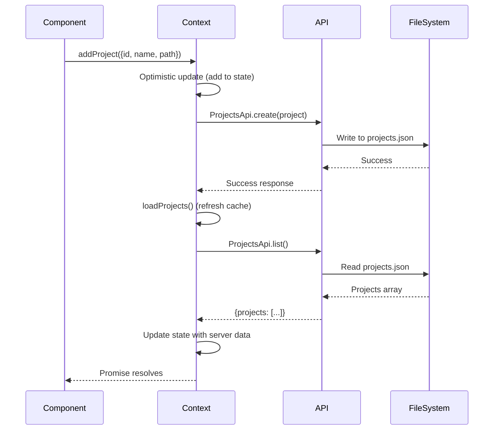
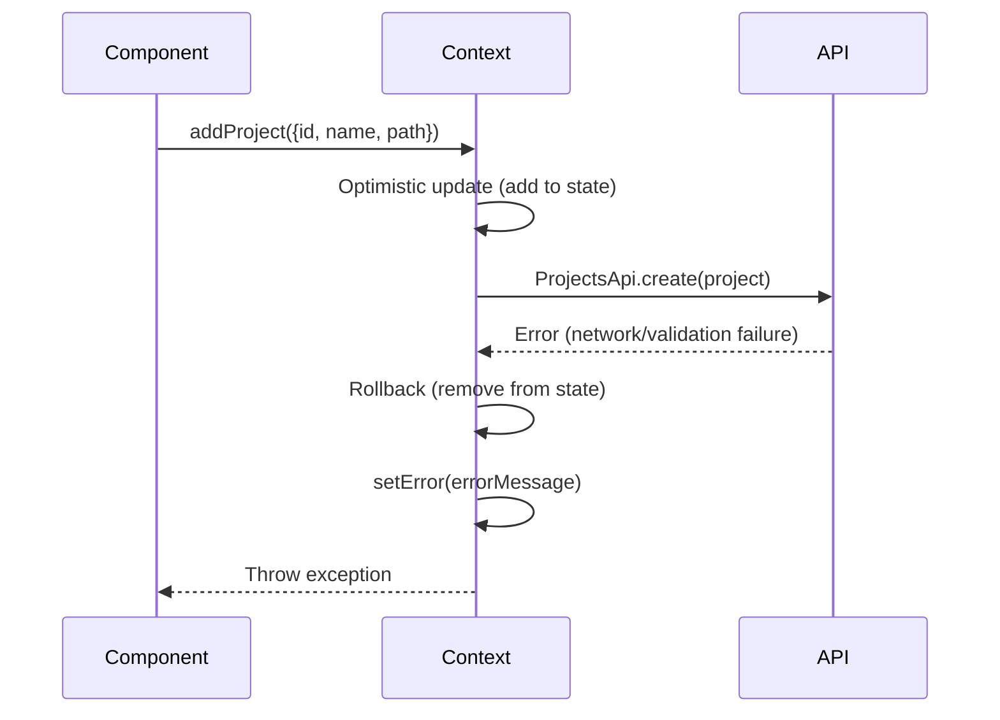

# ProjectsContext — Authoritative Documentation

## Executive Summary

ProjectsContext is a global React context provider that manages the centralized state of all registered CodeRef projects across the dashboard application. The system provides a single source of truth for project data, eliminating redundant API calls through in-memory caching, and implements optimistic update patterns with automatic rollback on API failures. The context serves as the primary interface for project registration, removal, and state access throughout the application, ensuring consistent project data across all components and pages.

## Audience & Intent

- **Markdown (this document):** Defines state ownership, optimistic update contracts, caching strategy, and error recovery patterns. This is the authoritative source for understanding project state lifecycle, API integration, and rollback behavior.
- **TypeScript/Code:** Enforces compile-time contracts via `ProjectsContextState` interface and runtime behavior through context provider implementation.
- **API Contracts:** `/api/coderef/projects` route defines server-side persistence and validation rules.

## 1. Architecture Overview

### Component Hierarchy

```
ProjectsProvider (Context Provider)
├── State Management (useState hooks)
│   ├── projects: CodeRefProject[]
│   ├── isLoading: boolean
│   └── error: string | null
├── API Integration (ProjectsApi)
│   ├── list() - Load all projects
│   ├── create() - Register new project
│   └── remove() - Remove project
└── useProjects() Hook
    └── Access context in components
        ├── Settings ProjectsPanel (project CRUD)
        ├── Scanner (read-only display)
        ├── CodeRef Explorer (selection)
        └── Other pages (consumption)
```

### Key Integration Points

- **ProjectsApi:** Client-side API wrapper (`packages/dashboard/src/lib/coderef/api-access.ts`)
- **API Route:** `/api/coderef/projects` for server-side persistence (`packages/dashboard/src/app/api/coderef/projects/route.ts`)
- **Scanner API Routes:** Also use unified storage at `/api/scanner/projects` and `/api/scanner/scan`
- **Storage:** Unified file system storage at `~/.coderef-dashboard/projects.json` (all systems)
- **Components:** All components that need project data use `useProjects()` hook
- **Settings Integration:** ProjectsPanel is the primary UI for project management (add/remove)

### Role in System

ProjectsContext serves as the **single source of truth** for project registrations:
1. **Initialization:** Loads projects from API on mount (once per app session)
2. **Caching:** Maintains in-memory cache to avoid redundant API calls
3. **Optimistic Updates:** Provides immediate UI feedback with automatic rollback on failure
4. **State Distribution:** Makes project data available to all components via React context

## 2. State Ownership & Source of Truth (Canonical)

| State | Owner | Type | Persistence | Source of Truth |
|-------|-------|------|-------------|-----------------|
| `projects` | `ProjectsProvider` | Domain | File system (via API) | `~/.coderef-dashboard/projects.json` |
| `isLoading` | `ProjectsProvider` | UI | None (in-memory) | `useState<boolean>` |
| `error` | `ProjectsProvider` | UI | None (in-memory) | `useState<string \| null>` |
| `loadProjects` | `ProjectsProvider` | System | None (function) | `useCallback` hook |
| `addProject` | `ProjectsProvider` | System | None (function) | `useCallback` hook |
| `removeProject` | `ProjectsProvider` | System | None (function) | `useCallback` hook |

### State Ownership Rules

1. **Projects Array:** The `ProjectsProvider` owns the `projects` array. Components must use context methods (`addProject`, `removeProject`, `loadProjects`) to modify projects. Direct state mutation is forbidden.

2. **Caching Strategy:** Projects are loaded once on mount and cached in memory. Manual `loadProjects()` calls refresh the cache from API.

3. **Optimistic Updates:** `addProject` and `removeProject` update state immediately (optimistic), then sync with API. On API failure, state is rolled back to previous value.

4. **Error State:** Error state is cleared on successful operations and set on API failures. Errors are not persisted across page reloads.

5. **Loading State:** `isLoading` is `true` during initial mount fetch and manual `loadProjects()` calls. It becomes `false` after fetch completes (success or error).

## 3. Data Persistence

### Storage Location

**File Path:** `~/.coderef-dashboard/projects.json` (user's home directory)

**⚠️ IMPORTANT:** This is the **unified storage location** for ALL project systems:
- Settings ProjectsPanel (add/remove UI)
- Scanner (consumes for scan operations)
- CodeRef Explorer (consumes for file browsing)
- All other pages that need project data

**Legacy Storage (Deprecated):**
- `~/.coderef-scanner-projects.json` - No longer used (as of 2026-01-13)
- Projects must be migrated manually by re-adding in Settings

**Storage Schema:**
```typescript
interface ProjectsStorage {
  projects: CodeRefProject[];
  updatedAt: string; // ISO 8601 timestamp
}
```

**Project Schema:**
```typescript
interface CodeRefProject {
  id: string;           // Unique identifier
  name: string;         // Human-readable name
  path: string;         // Absolute file system path
  addedAt: string;      // ISO 8601 timestamp
}
```

### Persistence Flow

1. **Initial Load:** On mount, `useEffect` calls `loadProjects()` → `ProjectsApi.list()` → API reads from `~/.coderef-dashboard/projects.json`
2. **Add Project:** `addProject()` → Optimistic update → `ProjectsApi.create()` → API writes to file → `loadProjects()` refreshes cache
3. **Remove Project:** `removeProject()` → Optimistic update → `ProjectsApi.remove()` → API updates file → No cache refresh (optimistic state is final)

### Storage Directory Creation

The API route automatically creates `~/.coderef-dashboard/` directory if it doesn't exist via `ensureStorageDir()` function.

### File System Access

- **Web Mode:** API route handles file system access (server-side only)
- **Electron Mode:** Same API route, but Electron has native file system access
- **Path Format:** Absolute paths stored as strings (Windows: `C:\Users\...`, Unix: `/home/...`)

## 4. State Lifecycle

### Initialization

1. **Mount:** `ProjectsProvider` component mounts
2. **Default State:** `projects = []`, `isLoading = true`, `error = null`
3. **Effect Trigger:** `useEffect` calls `loadProjects()` on mount
4. **API Call:** `ProjectsApi.list()` fetches from `/api/coderef/projects`
5. **State Update:** On success: `setProjects(response.projects)`, `setIsLoading(false)`
6. **Error Handling:** On failure: `setError(errorMessage)`, `setIsLoading(false)`

### Add Project Flow

1. **User Action:** Component calls `addProject({ id, name, path })`
2. **Optimistic Update:** Project added to `projects` array immediately with `addedAt` timestamp
3. **API Call:** `ProjectsApi.create(project)` called in background
4. **Success Path:**
   - API writes to file system
   - `loadProjects()` refreshes cache from API (gets server state)
   - Optimistic state replaced with server state
5. **Failure Path:**
   - API call fails
   - Rollback: `setProjects(prev => prev.filter(p => p.id !== project.id))`
   - Error set: `setError(errorMessage)`
   - Exception re-thrown for caller to handle

### Remove Project Flow

1. **User Action:** Component calls `removeProject(projectId)`
2. **State Capture:** Original `projects` array stored in `originalProjects` variable
3. **Optimistic Update:** Project removed from `projects` array immediately
4. **API Call:** `ProjectsApi.remove(projectId)` called in background
5. **Success Path:**
   - API removes from file system
   - Optimistic state is final (no cache refresh needed)
6. **Failure Path:**
   - API call fails
   - Rollback: `setProjects(originalProjects)` restores previous state
   - Error set: `setError(errorMessage)`
   - Exception re-thrown for caller to handle

### Reload Flow

1. **User Action:** Component calls `loadProjects()` (manual refresh)
2. **Loading State:** `setIsLoading(true)`, `setError(null)`
3. **API Call:** `ProjectsApi.list()` fetches from API
4. **State Update:** On success: `setProjects(response.projects)`, `setIsLoading(false)`
5. **Error Handling:** On failure: `setError(errorMessage)`, `setIsLoading(false)`

## 5. Behaviors (Events & Side Effects)

### User Behaviors

| Action | Trigger | Handler | Side Effects |
|--------|---------|---------|--------------|
| Add Project | Component calls `addProject()` | `addProject` callback | Optimistic update, API call, cache refresh on success, rollback on failure |
| Remove Project | Component calls `removeProject()` | `removeProject` callback | Optimistic update, API call, rollback on failure |
| Reload Projects | Component calls `loadProjects()` | `loadProjects` callback | Loading state, API call, state update |
| Access Projects | Component uses `useProjects()` | Context hook | Returns current state (no side effects) |

### System Behaviors

| Event | Trigger | Handler | Side Effects |
|-------|---------|---------|--------------|
| Component Mount | `ProjectsProvider` mounts | `useEffect` with `loadProjects` dependency | Automatic project loading |
| API Success (Add) | `ProjectsApi.create()` succeeds | `loadProjects()` refresh | Cache updated with server state |
| API Failure (Add) | `ProjectsApi.create()` fails | Rollback logic | Project removed from state, error set |
| API Failure (Remove) | `ProjectsApi.remove()` fails | Rollback logic | Project restored to state, error set |
| API Failure (Load) | `ProjectsApi.list()` fails | Error handling | Error state set, loading cleared |

## 6. Event & Callback Contracts

### ProjectsContextState Interface

| Property | Type | Required | Description |
|----------|------|----------|-------------|
| `projects` | `CodeRefProject[]` | Yes | Array of all registered projects |
| `isLoading` | `boolean` | Yes | Loading state for initial fetch or manual reload |
| `error` | `string \| null` | Yes | Error message if API call fails |
| `loadProjects` | `() => Promise<void>` | Yes | Reload projects from API |
| `addProject` | `(project: { id: string; name: string; path: string }) => Promise<void>` | Yes | Add project with optimistic update |
| `removeProject` | `(projectId: string) => Promise<void>` | Yes | Remove project with optimistic update |

### addProject Contract

**Input:**
```typescript
{
  id: string;      // Unique project identifier
  name: string;    // Human-readable project name
  path: string;    // Absolute file system path
}
```

**Behavior:**
- Optimistically adds project to state immediately
- Calls `ProjectsApi.create()` in background
- On success: Refreshes cache via `loadProjects()`
- On failure: Rolls back optimistic update, sets error, throws exception

**Error Handling:**
- Throws exception on API failure (caller must handle)
- Error message available in `error` state
- State automatically rolled back

### removeProject Contract

**Input:**
```typescript
projectId: string  // ID of project to remove
```

**Behavior:**
- Captures current state for rollback
- Optimistically removes project from state immediately
- Calls `ProjectsApi.remove()` in background
- On success: Optimistic state is final (no refresh)
- On failure: Rolls back to captured state, sets error, throws exception

**Error Handling:**
- Throws exception on API failure (caller must handle)
- Error message available in `error` state
- State automatically rolled back to pre-operation state

### loadProjects Contract

**Input:** None

**Behavior:**
- Sets `isLoading = true`, `error = null`
- Calls `ProjectsApi.list()` to fetch from API
- On success: Updates `projects` array, sets `isLoading = false`
- On failure: Sets `error` message, sets `isLoading = false`

**Error Handling:**
- Does not throw exceptions (errors stored in state)
- Caller checks `error` state for failures

## 7. Performance Considerations

### Known Limits

- **Project Count:** No explicit limit, but performance degrades with 100+ projects
- **API Response Size:** Projects array stored in memory (typically <10KB for 50 projects)
- **Cache Duration:** Projects cached for entire app session (until page reload)

### Bottlenecks

1. **Initial Load:** First mount triggers API call (blocking). Consider loading indicator.
2. **Concurrent Operations:** Multiple `addProject`/`removeProject` calls may cause race conditions (not currently prevented).

### Optimization Opportunities

- **Debounced Reloads:** Debounce `loadProjects()` calls if multiple components trigger reloads
- **Request Deduplication:** Prevent concurrent `loadProjects()` calls (currently not implemented)
- **Selective Updates:** Only refresh changed projects instead of full reload (future optimization)

### Deferred Optimizations

- **Pagination:** Not needed until 100+ projects (current limit)
- **Lazy Loading:** All projects loaded upfront (acceptable for typical use cases)
- **WebSocket Updates:** Real-time project updates not implemented (future feature)

## 8. Accessibility

### Current Gaps

| Issue | Severity | Description |
|-------|----------|-------------|
| No loading announcements | Minor | Screen readers not notified when projects load |
| Error announcements | Minor | Error messages not announced to screen readers |
| No keyboard shortcuts | Minor | No keyboard shortcuts for add/remove operations |

### Required Tasks

1. **Priority 2:** Add `aria-live` region for loading and error states
2. **Priority 3:** Add keyboard shortcuts for project management (if UI supports it)

## 9. Testing Strategy

### Must-Cover Scenarios

1. **Initial Load:**
   - Projects load on mount
   - Loading state shows during fetch
   - Error state set on API failure
   - Empty array returned if no projects

2. **Add Project:**
   - Optimistic update adds project immediately
   - API call succeeds → cache refreshed
   - API call fails → rollback occurs
   - Error state set on failure
   - Exception thrown on failure

3. **Remove Project:**
   - Optimistic update removes project immediately
   - API call succeeds → state remains removed
   - API call fails → rollback restores project
   - Error state set on failure
   - Exception thrown on failure

4. **Reload Projects:**
   - Manual `loadProjects()` refreshes cache
   - Loading state during reload
   - Error handling on failure

5. **Concurrent Operations:**
   - Multiple `addProject` calls (race condition potential)
   - `removeProject` while `loadProjects` in progress

6. **Error Recovery:**
   - Error state cleared on successful operation
   - Error persists until next operation

### Explicitly Not Tested

- **File System Operations:** API route handles file I/O (tested separately)
- **Storage Directory Creation:** API route responsibility
- **Path Validation:** API route validates paths (tested separately)

## 10. Non-Goals / Out of Scope

The following features are explicitly **not** part of ProjectsContext v1.0:

1. **Project Validation:** Path existence validation is API route responsibility
2. **Project Ordering:** Projects array order is not guaranteed or sorted
3. **Project Filtering:** No built-in filtering (components filter as needed)
4. **Project Search:** No search functionality (components implement if needed)
5. **Project Groups:** No grouping or categorization
6. **Project Metadata:** Only stores `id`, `name`, `path`, `addedAt` (no custom fields)
7. **Project Permissions:** No permission or access control
8. **Project Sharing:** No multi-user or sharing features
9. **Project Sync:** No synchronization with external systems
10. **Undo/Redo:** No operation history or undo capability

## 11. Common Pitfalls & Sharp Edges

### Known Issues

1. **Race Conditions:**
   - **Issue:** Multiple `addProject` calls can cause race conditions
   - **Impact:** Projects may be added out of order or duplicates may appear
   - **Mitigation:** Callers should disable UI during operations or implement request queuing

2. **Rollback State Capture:**
   - **Issue:** `removeProject` captures `projects` state at call time, not operation start
   - **Impact:** If state changes between capture and rollback, rollback may restore wrong state
   - **Mitigation:** Current implementation is correct for single-operation scenarios

3. **Error State Persistence:**
   - **Issue:** Error state persists until next operation (may confuse users)
   - **Impact:** Users may see stale error messages
   - **Mitigation:** Components should clear error state or show error clearly

4. **Cache Staleness:**
   - **Issue:** Projects cached in memory, external changes not reflected
   - **Impact:** If projects.json modified externally, context state is stale
   - **Mitigation:** Manual `loadProjects()` call refreshes cache

5. **Optimistic Update Timing:**
   - **Issue:** `addProject` refreshes cache after API success, replacing optimistic state
   - **Impact:** Brief flash of optimistic project, then server state replaces it
   - **Mitigation:** Acceptable UX tradeoff for immediate feedback

### Integration Gotchas

1. **Provider Required:**
   - `useProjects()` throws error if used outside `ProjectsProvider`
   - Must wrap app or relevant subtree with `ProjectsProvider`

2. **Async Operations:**
   - `addProject` and `removeProject` are async and may throw
   - Callers must handle exceptions with try/catch

3. **Loading State:**
   - `isLoading` is `true` during initial mount
   - Components should show loading indicator during mount

4. **Empty State:**
   - `projects` array is empty `[]` initially and after mount if no projects exist
   - Components should handle empty array gracefully

### Configuration Mistakes

1. **Missing Provider:**
   - Forgetting to wrap app with `ProjectsProvider` causes runtime errors
   - Error message: "useProjects must be used within a ProjectsProvider"

2. **Concurrent API Calls:**
   - Multiple components calling `loadProjects()` simultaneously causes redundant API calls
   - Consider debouncing or request deduplication

3. **Error Handling:**
   - Not handling exceptions from `addProject`/`removeProject` causes unhandled promise rejections
   - Always wrap in try/catch

## 12. Diagrams (Optional)

### Optimistic Update Flow (Add Project)



**Note:** Diagrams are **illustrative**, not authoritative. State tables and text define truth.

### Rollback Flow (Add Project Failure)



**Note:** Diagrams are **illustrative**, not authoritative. State tables and text define truth.

## Conclusion

ProjectsContext is a production-ready global state management system that provides centralized project data with optimistic updates and automatic error recovery. The system uses in-memory caching to eliminate redundant API calls and implements rollback patterns to ensure state consistency even when API operations fail.

**Maintenance Expectations:**
- This document defines the authoritative contracts for project state, optimistic updates, and error recovery
- Future enhancements (project validation, ordering, filtering) must not break existing contracts
- State ownership rules must be followed to prevent bugs and maintain refactor safety
- Optimistic update patterns are critical to UX and must be preserved

**Usage:**
- Developers implementing project management features must reference this document for state ownership and callback contracts
- Testers must cover all "Must-Cover Scenarios" before release
- Code reviewers must verify compliance with optimistic update patterns and rollback logic
