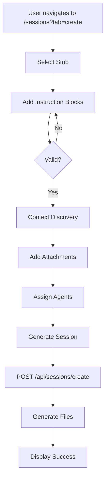
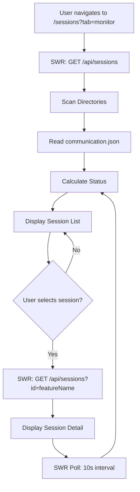

# Sessions Hub System — Authoritative Documentation

## Executive Summary

The Sessions Hub System is a multi-agent coordination platform that enables creation, monitoring, and management of parallel agent execution sessions. The system orchestrates two primary workflows: **Session Creation** (4-step wizard generating comprehensive context packages) and **Session Monitoring** (real-time status tracking with SWR polling). The architecture separates concerns across five core files: data layer (`sessions.ts`), UI orchestration (`SessionsHub/index.tsx`), creation workflow (`SessionCreation/index.tsx`), file generation API (`api/sessions/create/route.ts`), and monitoring container (`SessionMonitoringContainer.tsx`). This document defines the authoritative contracts for session state management, file generation, status calculation, and real-time updates.

## Audience & Intent

**Markdown (this document):** Architectural truth, state ownership rules, API contracts, workflow sequences, failure modes  
**TypeScript/Code:** Runtime behavior, type definitions, compile-time contracts  
**JSON Schemas:** `communication.json` structure, `instructions.json` format, session metadata validation  
**File System:** Session directory structure, file naming conventions, persistence locations

---

## 1. Architecture Overview

### 1.1 System Role

The Sessions Hub System sits at the intersection of:
- **Multi-agent coordination** (parallel task execution)
- **Context management** (15K+ line context packages)
- **Real-time monitoring** (10-second polling intervals)
- **File generation** (session artifacts: `context-backbone.md`, `communication.json`, `instructions.json`, `agent-prompts/*.md`)

### 1.2 Component Hierarchy

```
SessionsHub (index.tsx)
├── Tab Navigation (create | monitor)
├── SessionCreation (SessionCreation/index.tsx)
│   ├── Step 1: StubSelector + InstructionEditor
│   ├── Step 2: ContextDiscovery + AttachmentManager
│   ├── Step 3: AgentAssigner
│   ├── Step 4: SessionGenerator
│   └── Step 5: SessionCreationComplete
└── SessionMonitoringContainer
    ├── SessionsList (SWR polling)
    ├── SessionDetail (SWR polling)
    └── OutputViewer (modal)
        ├── File type detection (JSON/Markdown/Text)
        ├── JSON syntax highlighting
        ├── Markdown rendering with GitHub Flavored Markdown (tables, autolinks, strikethrough, task lists)
        └── File download functionality
```

### 1.3 Core Files & Responsibilities

| File | Lines | Responsibility | Key Exports |
|------|-------|----------------|------------|
| `lib/api/sessions.ts` | 362 | Data layer, type definitions, session reading, status calculation | `getAllSessions()`, `getSessionById()`, `getAgentOutput()`, `refreshSessionStatus()`, Type definitions |
| `SessionsHub/index.tsx` | 115 | Tab orchestration, URL state sync | `SessionsHub` component |
| `SessionCreation/index.tsx` | 381 | 4-step creation workflow, state management, validation | `SessionCreation` component |
| `api/sessions/create/route.ts` | 306 | Session file generation, POST endpoint | `POST` handler, generation functions |
| `SessionMonitoringContainer.tsx` | 211 | Real-time monitoring, SWR integration, output viewer | `SessionMonitoringContainer` component |

### 1.4 Integration Points

**Internal:**
- Uses `PromptingWorkflow` components (`AttachmentManager`) for file attachments
- Integrates with Next.js App Router (`/sessions` route)
- SWR for data fetching and polling

**External:**
- File system: Reads/writes to `C:\Users\willh\.mcp-servers\coderef\sessions` (default) or `coderef/sessions/`
- CodeRef data: Uses `.coderef/index.json`, `.coderef/graph.json` for context discovery
- Session files: `communication.json`, `instructions.json`, `context-backbone.md`

---

## 2. State Ownership & Source of Truth (Canonical)

### 2.1 State Ownership Table

| State | Owner | Type | Persistence | Source of Truth | Mutations |
|-------|-------|------|-------------|-----------------|-----------|
| `activeTab` | `SessionsHub/index.tsx` | UI State | URL param (`?tab=create\|monitor`) | URL search params | `handleTabChange()` |
| `SessionBuilderState` | `SessionCreation/index.tsx` | UI State | Component state (ephemeral) | React `useState` | `setState()` handlers |
| `currentStep` | `SessionCreation/index.tsx` | UI State | Component state (ephemeral) | React `useState` | `handleNext()`, `handleBack()` |
| `selectedSessionId` | `SessionMonitoringContainer.tsx` | UI State | Component state (ephemeral) | React `useState` | `handleSessionClick()` |
| `outputViewerState` | `SessionMonitoringContainer.tsx` | UI State | Component state (ephemeral) | React `useState` | `handleViewOutput()`, `handleCloseOutputViewer()` |
| Session metadata | File system | Domain State | `communication.json` | `communication.json` file | API `POST /api/sessions/create` |
| Session status | File system | Domain State | `communication.json` (calculated) | `communication.json` + `calculateSessionStatus()` | Agent updates, `refreshSessionStatus()` |
| Agent status | File system | Domain State | `communication.json` | `communication.json` file | Agent updates |
| Session files | File system | Domain State | `coderef/sessions/{sessionId}/` | File system | `POST /api/sessions/create` |

### 2.2 Precedence Rules

**Session Status Calculation:**
1. If `communication.json` has explicit `status` field → use it
2. Else → calculate from agent statuses via `calculateSessionStatus()`:
   - All agents `complete` → `complete`
   - Any agent `in_progress` → `in_progress`
   - Otherwise → `not_started`

**Tab State:**
1. URL param `?tab=create\|monitor` → highest priority (initializes and updates)
2. Component state → syncs to URL on change
3. Default → `'create'` if no URL param

**Session Data:**
1. File system (`communication.json`) → authoritative source
2. SWR cache → 10-second refresh interval
3. Component state → derived from SWR data

---

## 3. Data Persistence

### 3.1 Session Directory Structure

```
{coderef/sessions|C:\Users\willh\.mcp-servers\coderef\sessions}/
└── {sessionId}/  (format: {stub.id}-{timestamp})
    ├── communication.json       # Agent roster, status, coordination metadata
    ├── instructions.json         # Freeform instructions with type classification
    ├── context-backbone.md      # 15,000-20,000 line comprehensive context package
    └── agent-prompts/
        ├── agent-1.md           # Individual prompt for Agent 1
        ├── agent-2.md           # Individual prompt for Agent 2
        └── ...
```

### 3.2 File Schemas

#### `communication.json` Schema

```typescript
{
  session_id: string;              // Directory name
  stub_id: string;                 // Source stub identifier
  feature_name: string;            // Feature identifier
  created_at: string;              // ISO 8601 timestamp
  agents: Array<{
    agent_id: string;
    agent_number: number;          // 1-based index
    role: string;
    status: 'pending' | 'not_started' | 'in_progress' | 'complete' | 'blocked';
    assigned_instructions: number;
    assigned_attachments: number;
    output_files: string[];
    depends_on: string[];            // Agent IDs
    execution_wave: number;         // Calculated from dependencies
  }>;
  total_agents: number;
  coordination_mode: 'parallel';
  status: 'created' | 'not_started' | 'in_progress' | 'complete';
}
```

#### `instructions.json` Schema

```typescript
{
  total_blocks: number;
  blocks: Array<{
    id: string;
    type: 'task' | 'guideline' | 'example' | 'constraint';
    content: string;
    assigned_to: string[];          // Agent IDs
  }>;
  types_summary: {
    task: number;
    guideline: number;
    example: number;
    constraint: number;
  };
}
```

### 3.3 Storage Configuration

**Default Session Directory:**
- Hardcoded: `C:\Users\willh\.mcp-servers\coderef\sessions`
- Configurable: Can be overridden by `projects.config.json` (not yet implemented)

**Session ID Generation:**
- Format: `{stub.id}-{Date.now()}`
- Example: `STUB-082-1704729600000`

### 3.4 Failure Modes & Recovery

| Failure Mode | Detection | Recovery | User Impact |
|--------------|-----------|----------|-------------|
| Session directory missing | `directoryExists()` check | Skip directory, log warning | Sessions not listed |
| `communication.json` missing | `fs.existsSync()` check | Skip session | Session not listed |
| `communication.json` invalid JSON | `safeJSONParse()` catch | Return `null`, log error | Session not listed |
| Agent output file missing | `fs.existsSync()` check | Return placeholder: "Output file not yet created by agent." | User sees placeholder message |
| File read error | `try/catch` in `getAgentOutput()` | Return `null`, log error | Output viewer shows error |
| SWR fetch error | SWR `error` state | Display error UI, retry button | User can retry manually |
| Session generation failure | API error response | Display error message, prevent completion | User must fix and retry |

---

## 4. State Lifecycle

### 4.1 Session Creation Lifecycle

```
1. User navigates to /sessions?tab=create
   → SessionsHub initializes with activeTab='create'
   → SessionCreation mounts with empty state

2. Step 1: Stub Selection & Instructions
   → User selects stub → handleSelectStub() → state.selectedStub set
   → User adds instruction blocks → handleAddBlock() → state.instructionBlocks updated
   → Validation: stub required, >=1 block, no empty blocks

3. Step 2: Context & Attachments
   → ContextDiscovery scans files → contextFiles state updated
   → User adds attachments → handleAddAttachments() → state.attachments updated

4. Step 3: Agent Assignment
   → User assigns instructions/attachments to agents → state.agents updated

5. Step 4: Generate
   → User clicks generate → SessionGenerator calls POST /api/sessions/create
   → API generates files → returns sessionPath
   → handleComplete() → currentStep set to 5

6. Step 5: Complete
   → SessionCreationComplete displays success
   → User can navigate to monitor or create another
```

### 4.2 Session Monitoring Lifecycle

```
1. User navigates to /sessions?tab=monitor
   → SessionsHub initializes with activeTab='monitor'
   → SessionMonitoringContainer mounts

2. SWR Initial Fetch
   → GET /api/sessions → getAllSessions()
   → Scans session directories → reads communication.json files
   → Calculates aggregation stats → returns Session[]

3. Real-time Polling (10-second interval)
   → SWR revalidates → getAllSessions() called again
   → Status recalculated from latest communication.json
   → UI updates if status changed

4. Session Selection
   → User clicks session → handleSessionClick(featureName)
   → SWR fetches GET /api/sessions?id={featureName}
   → getSessionById() reads communication.json
   → Returns SessionDetail with agents, orchestrator, aggregation

5. Agent Output Viewing
   → User clicks "View Output" → handleViewOutput(agentId)
   → SWR fetches GET /api/sessions/output?feature={featureName}&agent={agentId}
   → getAgentOutput() reads agent.output_file
   → Returns file contents or placeholder

6. Manual Refresh
   → User clicks refresh → mutateSessionDetail()
   → SWR revalidates → latest data fetched
```

### 4.3 Status Calculation Lifecycle

```
1. Session Directory Scan
   → getAllSessions() reads communication.json
   → Extracts agents array

2. Aggregation Calculation
   → calculateAggregation(agents) → counts by status
   → Returns: { total_agents, completed, in_progress, not_started, blocked }

3. Session Status Calculation
   → calculateSessionStatus(agents) → determines overall status
   → Rules:
      - All complete → 'complete'
      - Any in_progress → 'in_progress'
      - Otherwise → 'not_started'

4. Status Update
   → If communication.json has explicit status → use it
   → Else → use calculated status
   → Returned in Session object
```

---

## 5. Behaviors (Events & Side Effects)

### 5.1 User Behaviors

| Action | Component | Handler | Side Effects |
|--------|-----------|---------|--------------|
| Click "Create Session" tab | `SessionsHub` | `handleTabChange('create')` | URL updated, `activeTab` set, `SessionCreation` rendered |
| Click "Monitor Sessions" tab | `SessionsHub` | `handleTabChange('monitor')` | URL updated, `activeTab` set, `SessionMonitoringContainer` rendered |
| Select stub | `SessionCreation` | `handleSelectStub(stub)` | `state.selectedStub` set, enables instruction editor |
| Add instruction block | `SessionCreation` | `handleAddBlock()` | New block added to `state.instructionBlocks` |
| Update instruction block | `SessionCreation` | `handleUpdateBlock(id, content, type)` | Block updated in `state.instructionBlocks` |
| Remove instruction block | `SessionCreation` | `handleRemoveBlock(id)` | Block removed from `state.instructionBlocks` |
| Add attachments | `SessionCreation` | `handleAddAttachments(attachments)` | Attachments added to `state.attachments` |
| Remove attachment | `SessionCreation` | `handleRemoveAttachment(id)` | Attachment removed from `state.attachments` |
| Click "Next" | `SessionCreation` | `handleNext()` | `currentStep` incremented (if valid) |
| Click "Back" | `SessionCreation` | `handleBack()` | `currentStep` decremented |
| Click "Generate" | `SessionGenerator` | `handleGenerate()` | POST /api/sessions/create, files generated, completion triggered |
| Click session in list | `SessionMonitoringContainer` | `handleSessionClick(featureName)` | `selectedSessionId` set, detail view rendered |
| Click "View Output" | `SessionDetail` | `handleViewOutput(agentId)` | Output viewer modal opened, SWR fetches output |
| Click "Refresh" | `SessionDetail` | `handleRefreshSessionDetail()` | `mutateSessionDetail()` called, SWR revalidates |

### 5.2 System Behaviors

| Event | Component | Handler | Side Effects |
|-------|-----------|---------|--------------|
| URL param change | `SessionsHub` | `useEffect([searchParams])` | `activeTab` synced from URL |
| SWR poll (10s) | `SessionMonitoringContainer` | SWR `refreshInterval` | `getAllSessions()` called, UI updates if data changed |
| SWR poll (10s) | `SessionMonitoringContainer` | SWR `refreshInterval` | `getSessionById()` called, detail view updates |
| Window focus | `SessionMonitoringContainer` | SWR `revalidateOnFocus` | Data revalidated on tab focus |
| Network reconnect | `SessionMonitoringContainer` | SWR `revalidateOnReconnect` | Data revalidated on reconnect |
| Context discovery | `ContextDiscovery` | `GET /api/sessions/context-discovery` | Files scanned, relevance scores calculated, auto-selected (>=90%) |

---

## 6. Event & Callback Contracts

### 6.1 SessionCreation Props & Callbacks

| Prop | Type | Required | Purpose |
|------|------|----------|---------|
| (none - self-contained) | - | - | Component manages own state internally |

**Internal Callbacks:**
- `handleSelectStub(stub: Stub)` → Updates `state.selectedStub`
- `handleAddBlock()` → Adds new instruction block
- `handleUpdateBlock(id, content, type)` → Updates block
- `handleRemoveBlock(id)` → Removes block
- `handleAddAttachments(attachments)` → Adds attachments
- `handleRemoveAttachment(id)` → Removes attachment
- `handleClearAttachments()` → Clears all attachments
- `handleContextSelection(files)` → Updates `contextFiles` state
- `handleNext()` → Advances step (if valid)
- `handleBack()` → Goes back step
- `handleComplete(sessionPath)` → Sets completion state

### 6.2 SessionMonitoringContainer Props & Callbacks

| Prop | Type | Required | Purpose |
|------|------|----------|---------|
| `className` | `string` | No | Additional CSS classes |

**Internal Callbacks:**
- `handleSessionClick(featureName: string)` → Sets `selectedSessionId`
- `handleBackToList()` → Clears `selectedSessionId`
- `handleViewOutput(agentId: string)` → Opens output viewer
- `handleCloseOutputViewer()` → Closes output viewer
- `handleRefreshSessionDetail()` → Triggers SWR revalidation

### 6.3 API Endpoints

| Endpoint | Method | Request | Response | Side Effects |
|----------|--------|---------|----------|--------------|
| `/api/sessions` | GET | (none) | `{ sessions: Session[], count: number }` | Reads file system, calculates status |
| `/api/sessions?id={featureName}` | GET | Query param: `id` | `{ session: SessionDetail }` | Reads `communication.json`, calculates aggregation |
| `/api/sessions/create` | POST | `SessionCreateRequest` | `{ success: boolean, sessionId: string, sessionPath: string, files: string[] }` | Creates directory, generates files |
| `/api/sessions/output?feature={featureName}&agent={agentId}` | GET | Query params: `feature`, `agent` | `{ content: string, feature: string, agent: string }` | Reads agent output file |
| `/api/sessions/context-discovery?stubDescription={text}&projectPath={path}` | GET | Query params: `stubDescription`, `projectPath` | `{ files: ContextFile[], autoSelected: string[], keywords: string[], statsByType: Record<string, number> }` | Scans files, calculates relevance |

---

## 7. Performance Considerations

### 7.1 Known Limits

| Operation | Limit | Tested Threshold | Impact |
|-----------|-------|------------------|--------|
| Session directory scan | ~100 sessions | Not tested | Linear scan time increases with session count |
| `context-backbone.md` generation | 15K-20K lines | Not tested | Large file generation may timeout on slow systems |
| SWR polling interval | 10 seconds | Tested | Balance between freshness and server load |
| Concurrent SWR requests | Multiple sessions | Not tested | Each selected session triggers separate SWR request |

### 7.2 Bottlenecks

1. **File System I/O:**
   - `getAllSessions()` reads all `communication.json` files synchronously
   - No caching between polls (SWR handles client-side cache)
   - **Impact:** Slow on large session directories

2. **Context Discovery:**
   - Scans foundation docs, archived features, resource sheets, code elements
   - Reads file contents for keyword matching
   - **Impact:** Slow on large codebases

3. **Context Backbone Generation:**
   - Reads and embeds all context files into single markdown
   - No streaming or chunking
   - **Impact:** Large files may cause memory issues

### 7.3 Optimization Opportunities

1. **Session Directory Caching:**
   - Cache session list in memory with TTL
   - Only re-scan on explicit refresh or TTL expiry
   - **Status:** Not implemented

2. **Incremental Context Discovery:**
   - Cache relevance scores per stub description
   - Only re-scan changed files
   - **Status:** Not implemented

3. **Streaming File Generation:**
   - Stream `context-backbone.md` generation instead of building in memory
   - **Status:** Not implemented

### 7.4 Deferred Optimizations

- **Session indexing:** Database or index file for faster lookups (deferred: file-based approach sufficient for current scale)
- **WebSocket updates:** Real-time updates instead of polling (deferred: polling sufficient, WebSocket adds complexity)
- **Pagination:** Paginate session list for 100+ sessions (deferred: current scale doesn't require)

---

## 8. Accessibility

### 8.1 Current Gaps

| Issue | Severity | Component | Description |
|-------|----------|-----------|-------------|
| Tab navigation | Medium | `SessionsHub` | Tab buttons lack ARIA labels, no keyboard focus indicators |
| Progress indicator | Low | `SessionCreation` | Step numbers not announced to screen readers |
| Error messages | Medium | `SessionCreation` | Validation errors not associated with form fields via `aria-describedby` |
| Session list | Medium | `SessionsList` | List items not keyboard navigable, no focus management |
| Output viewer | High | `OutputViewer` | Modal lacks focus trap, close button not keyboard accessible |

### 8.2 Required Tasks

**Priority 1 (Critical):**
- Add focus trap to `OutputViewer` modal
- Add keyboard navigation to session list
- Associate validation errors with form fields

**Priority 2 (High):**
- Add ARIA labels to tab navigation
- Add `aria-live` region for status updates
- Add keyboard shortcuts for common actions

**Priority 3 (Medium):**
- Add focus indicators to all interactive elements
- Announce step changes to screen readers
- Add skip links for main content

---

## 9. Testing Strategy

### 9.1 Must-Cover Scenarios

**Session Creation:**
- [ ] Stub selection updates state correctly
- [ ] Instruction block add/update/remove works
- [ ] Validation prevents progression with invalid state
- [ ] Context discovery returns relevant files
- [ ] Agent assignment updates state correctly
- [ ] Session generation creates all required files
- [ ] Error handling displays user-friendly messages

**Session Monitoring:**
- [ ] Session list loads and displays all sessions
- [ ] Status calculation matches agent statuses
- [ ] SWR polling updates data every 10 seconds
- [ ] Session detail displays correct information
- [ ] Agent output viewer displays file contents
- [ ] Error states display retry options
- [ ] Empty states display helpful messages

**API Endpoints:**
- [ ] `GET /api/sessions` returns all sessions
- [ ] `GET /api/sessions?id={featureName}` returns correct session
- [ ] `POST /api/sessions/create` generates all files
- [ ] `GET /api/sessions/output` returns agent output
- [ ] Error responses return correct status codes

**Status Calculation:**
- [ ] `calculateSessionStatus()` returns correct status for all agent combinations
- [ ] `calculateAggregation()` counts agents correctly
- [ ] Status precedence (explicit vs calculated) works

### 9.2 Explicitly Not Tested

- **File system edge cases:** Permission errors, disk full, network drives (deferred: handled by error boundaries)
- **Large file handling:** 50K+ line context-backbone.md (deferred: current limit sufficient)
- **Concurrent session creation:** Multiple users creating sessions simultaneously (deferred: single-user system)
- **Session directory migration:** Moving sessions between directories (deferred: not a use case)

---

## 10. Non-Goals / Out of Scope

1. **Session editing:** Once created, sessions cannot be modified via UI (agents update `communication.json` directly)
2. **Session deletion:** No UI for deleting sessions (manual file system operation)
3. **Session templates:** No template system for reusing session configurations
4. **Agent communication:** No real-time chat or messaging between agents
5. **Session scheduling:** No ability to schedule sessions for future execution
6. **Multi-project sessions:** Sessions are scoped to single project (no cross-project coordination)
7. **Session versioning:** No version control for session files
8. **Session search/filtering:** No search or filter UI for session list (deferred: current scale doesn't require)

---

## 11. Common Pitfalls & Sharp Edges

### 11.1 Known Bugs/Quirks

1. **Session directory path hardcoded:**
   - Default path `C:\Users\willh\.mcp-servers\coderef\sessions` is hardcoded
   - **Workaround:** Modify `DEFAULT_SESSION_DIRS` in `sessions.ts`
   - **Fix:** Make configurable via `projects.config.json`

2. **Status calculation race condition:**
   - If agent updates `communication.json` during SWR poll, status may be stale
   - **Impact:** Status may not reflect latest agent state for up to 10 seconds
   - **Mitigation:** Manual refresh button available

3. **Context discovery timeout:**
   - Large codebases may timeout during context discovery
   - **Impact:** No files returned, user must retry
   - **Mitigation:** Add timeout handling, show progress indicator

### 11.2 Integration Gotchas

1. **AttachmentManager dependency:**
   - `SessionCreation` imports `AttachmentManager` from `PromptingWorkflow`
   - **Risk:** Changes to `PromptingWorkflow` may break session creation
   - **Mitigation:** Shared component contract should be stable

2. **SWR polling conflicts:**
   - Multiple components polling same endpoint may cause duplicate requests
   - **Impact:** Unnecessary server load
   - **Mitigation:** SWR deduplicates requests automatically

3. **File path validation:**
   - `getAgentOutput()` doesn't validate paths for directory traversal
   - **Risk:** Potential security issue if agent.output_file is malicious
   - **Mitigation:** Add path validation, restrict to session directory

### 11.3 Configuration Mistakes

1. **Session directory not created:**
   - If default directory doesn't exist, sessions won't be listed
   - **Symptom:** Empty session list, no error message
   - **Fix:** Create directory manually or add auto-creation

2. **Invalid communication.json:**
   - Malformed JSON causes session to be skipped silently
   - **Symptom:** Session not appearing in list
   - **Fix:** Validate JSON structure, show error in UI

3. **Missing agent output files:**
   - If agent hasn't created output file yet, viewer shows placeholder
   - **Symptom:** "Output file not yet created by agent." message
   - **Fix:** Wait for agent to complete, or check file path in `communication.json`

4. **Markdown rendering:**
   - OutputViewer uses `remark-gfm` for GitHub Flavored Markdown support
   - Supports tables, autolinks, strikethrough, task lists, and other GFM features
   - Consistent with FileViewer component for unified markdown rendering

### 11.4 Edge Cases

1. **Empty session list:**
   - If no sessions exist, list is empty with no message
   - **Impact:** User may think system is broken
   - **Fix:** Add empty state message

2. **Session with no agents:**
   - If `communication.json` has empty agents array, aggregation shows 0/0
   - **Impact:** Status calculation may be incorrect
   - **Fix:** Handle empty agents array in status calculation

3. **Concurrent session creation:**
   - If user creates multiple sessions rapidly, sessionId collisions possible
   - **Impact:** Later session overwrites earlier (unlikely due to timestamp)
   - **Fix:** Add UUID or sequence number to sessionId

---

## 12. Diagrams

### 12.1 Session Creation Flow



**Note:** Diagram is illustrative. Actual flow defined in Section 4.1.

### 12.2 Session Monitoring Flow



**Note:** Diagram is illustrative. Actual flow defined in Section 4.2.

---

## 13. API Contracts

### 13.1 Type Definitions

**Location:** `packages/dashboard/src/lib/api/sessions.ts`

**Core Types:**
```typescript
type SessionStatus = 'not_started' | 'in_progress' | 'complete';
type AgentStatus = 'not_started' | 'in_progress' | 'complete' | 'blocked';

interface Session {
  workorder_id: string;
  feature_name: string;
  status: SessionStatus;
  created: string;
  description: string;
  total_agents: number;
  completed_agents: number;
}

interface AgentInfo {
  agent_id: string;
  workorder_id?: string;
  agent_path?: string;
  role: string;
  status: AgentStatus;
  output_file: string;
  output_directory?: string;
  phases?: string[];
  notes?: string;
  forbidden_files?: string[];
  depends_on?: string[];
  context_file?: string;
}

interface SessionDetail extends Session {
  orchestrator: OrchestratorInfo;
  agents: AgentInfo[];
  parallel_execution?: ParallelExecutionInfo;
  aggregation?: AggregationInfo;
  instructions_file?: string;
}
```

### 13.2 Function Contracts

**`getAllSessions(): Promise<Session[]>`**
- **Input:** None
- **Output:** Array of session summaries
- **Side Effects:** Reads file system, calculates status
- **Errors:** Logs warnings for missing directories, returns empty array on error

**`getSessionById(featureName: string): Promise<SessionDetail | null>`**
- **Input:** Feature name (directory name)
- **Output:** Full session details or null if not found
- **Side Effects:** Reads `communication.json`, calculates aggregation
- **Errors:** Returns null if file missing or invalid

**`getAgentOutput(featureName: string, agentId: string): Promise<string | null>`**
- **Input:** Feature name, agent ID
- **Output:** File contents or null
- **Side Effects:** Reads agent output file
- **Errors:** Returns null if file missing, returns placeholder if not yet created

**`refreshSessionStatus(featureName: string): Promise<SessionStatusUpdate | null>`**
- **Input:** Feature name
- **Output:** Updated status summary or null
- **Side Effects:** Re-reads `communication.json`, recalculates aggregation
- **Errors:** Returns null if session not found

---

## 14. Maintenance Protocol

### 14.1 When to Update This Document

- **Breaking changes:** API contract changes, type definition changes
- **New features:** New session creation steps, new monitoring capabilities
- **Performance changes:** Optimization implementations, new bottlenecks discovered
- **Bug fixes:** Documented pitfalls resolved, edge cases handled

### 14.2 Versioning

- **Major version:** Breaking API changes, architectural changes
- **Minor version:** New features, new types, new endpoints
- **Patch version:** Bug fixes, documentation updates, clarifications

### 14.3 Deprecation Process

1. Mark deprecated sections with `⚠️ DEPRECATED` header
2. Add migration notes for breaking changes
3. Update version number in header
4. Archive old behavior in appendix if needed
5. Remove deprecated sections after 2 major versions

---

## Conclusion

This resource sheet defines the authoritative contracts for the Sessions Hub System, a multi-agent coordination platform enabling session creation and monitoring. The system is architected across five core files: data layer (`sessions.ts`), UI orchestration (`SessionsHub/index.tsx`), creation workflow (`SessionCreation/index.tsx`), file generation API (`api/sessions/create/route.ts`), and monitoring container (`SessionMonitoringContainer.tsx`). 

**Key Contracts:**
- Session state is owned by file system (`communication.json`), with UI state managed by React components
- Status calculation follows precedence: explicit status in JSON → calculated from agent statuses
- Real-time updates use SWR with 10-second polling intervals
- Session files are generated in `coderef/sessions/{sessionId}/` with four core artifacts

**Usage:**
- Developers modifying session logic must respect state ownership rules (Section 2)
- API consumers must follow contracts defined in Section 13
- Testers must cover scenarios in Section 9.1
- Accessibility improvements must address gaps in Section 8

**Maintenance:**
- Update this document when making breaking changes or adding features
- Follow versioning protocol in Section 14.2
- Mark deprecated sections with `⚠️ DEPRECATED` header

---

**Maintained by:** CodeRef Assistant (Orchestrator Persona)  
**Template Version:** 1.0.0  
**Created:** 2026-01-11  
**Last Updated:** 2026-01-11
